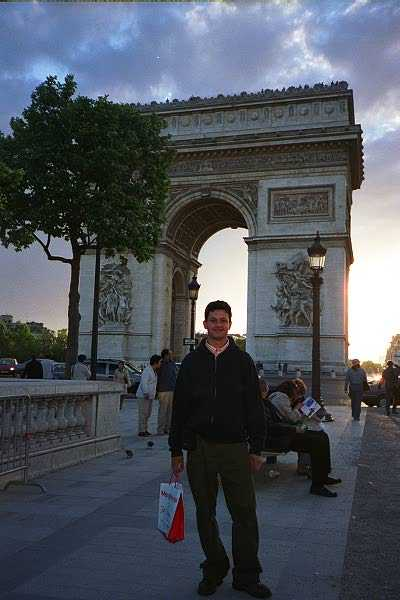
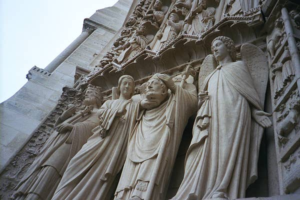
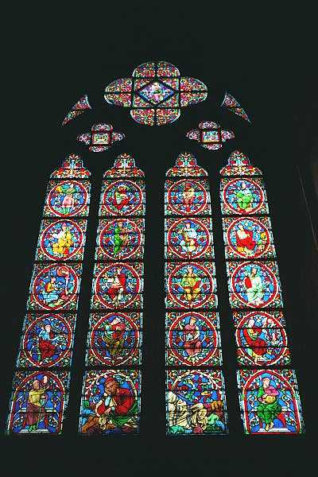
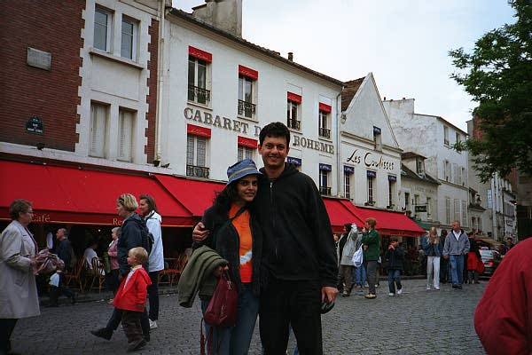
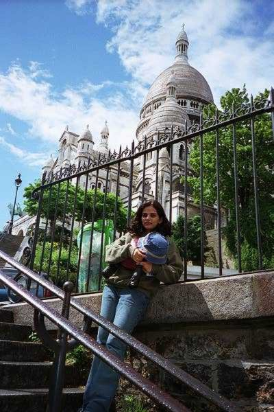
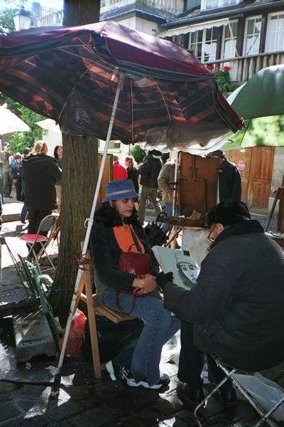
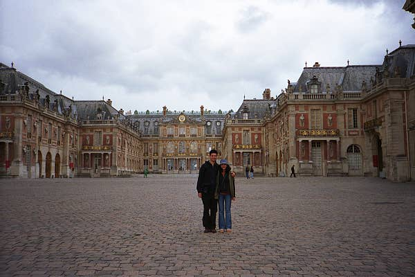
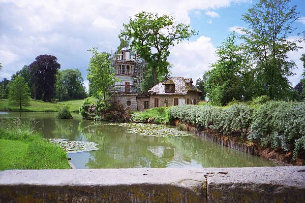
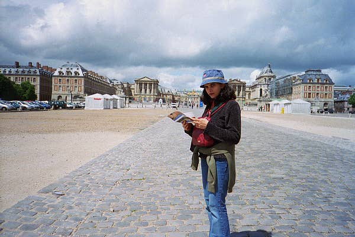

# Paris and Versailles, May 2002
### Four evenings in Paris

(Click [here](#photo-gallery) to jump directly to photos)

For most of our time in Paris the weather was cloudy and rainy, but it wasn't too cold - very pleasant after two weeks of Bombay weather. Paris (and most of Europe) is at the same latitude as Canada, but with much warmer weather. As a result the days were VERY long - it was bright sunshine outside by 6, and the light lasted till 10.30 at night. These were easily the longest days I've ever experienced.

Most of our first afternoon after landing was spent just getting from the airport to the hotel. The French have a reputation for inefficiency which seems to be well-deserved. It took me (Abhi) about an hour and a half after my plane landed just to collect my bags and meet Sejal. The terminal at which my plane landed didn't look that much better than the one at Bombay, but Sejal's terminal (the Air France one) seemed to be newer and better-maintained.

We took a bus into the city. The traffic into Paris is a nightmare, simply Bombay traffic on better roads. Since September 11 they've stopped renting out lockers at the airport for security reasons, so we had to drag all our three (not light) suitcases around with us. The areas around Paris look surprisingly run-down, although the buildings get significantly better-looking once you're in the city. One of the first things you notice about the city is how none of the streets are perpendicular to each other. There were many places with six or more streets converging on a single intersection, and an intricate knowledge of the layout must be essential to driving in the city. The streets are also a lot narrower than in the US, and there seem to be a lot of cars driving too fast considering the amount of traffic. We got to our hotel at about 6.30, almost 5 hours after landing. The hotel was clean and pleasant but fitting both of us and the three suitcases into our room at the same time took some skill. (Considering the price we'd paid and the area we were staying in, I still thought it was a very good bargain.) Since there wasn't too much place to stretch our legs in the room we decided to try and visit the Eiffel Tower, less than a mile away from the hotel. (We could see the top half of the tower from our room.)

Walking in the streets of Paris is a pleasure in itself. Most of the buildings look like they were built in the 19th century and have not been touched since. In the US this would have been preserved as a "historic district" - in Paris it's just part of the city, and we saw similar buildings everywhere we went. The Eiffel Tower is more impressive than most photographs convey, especially right at the base. The names of a number of famous French scientists are inscribed all around the circumference of the tower, a nicer touch than writing the names of famous military heroes or kings, I thought. The tower was built in 1889 and is an amazing mass of girders and steel beams close up. We had heard horror stories of the long lines to get up the tower, but the other tourists seemed to be taking a day off because we were in the lift to go up in less than ten minutes. There are three observation levels, with better views the higher you go. It was a fairly clear evening and it was a good way to get a bird's eye view of a new city. The jet lag started kicking in at about 9 pm, however, so we descended and got back to the hotel early.

 

On the itinerary for day 2 was a visit to the Louvre. This is the largest museum in the world, and has a huge collection of primarily Western painting and sculpture, most from the 13th century onward. We had read that only about 10% of the museum's collection is on display at any given time, due to lack of both staff and space - needless to say, seeing it all in one visit is impossible. Since neither of us consider ourselves great lovers of art we were prepared to visit the major destinations - the Mona Lisa, the Venus de Milo statue - and make a quick getaway. In the event the visit was probably the highlight of our Paris trip. More than the paintings (which most of the space in the museum is dedicated to) we were captivated by the sculptures, the sheer perfection of proportion and subtlety of expression that can be carved out of marble (in most cases). There are sections on Roman and Greek sculpture, some pieces more than two thousand years old, and others on more recent French and other Western sculpture. Almost all the sculptures are made of marble, some of bronze. It was tempting to photograph each one but keeping in mind the costs of film developing in the US we decided that selectivity was the better part of enthusiasm and managed to spend only one and a half rolls of film on them. We were in the museum for almost six hours and they were very well spent. The Mona Lisa looks exactly the same as in all the cheap reproductions you've seen - even the smile is not more mysterious. It was also one of the few things in the museum that was behind security glass - almost everything else (many more beautiful than the most famous painting in the world) is within touching distance.

The Louvre lies at one end of the most high-fashion street in Paris, the Champs-Elysees, that stretches for a kilometer to the Arc de Triomphe (the Arch of Victory) at the other end. The street is lined with what were originally residential buildings but have now been converted into commercial establishments - I remember seeing a TV program in which they said that only 15 residential apartments now exist on the whole street, and the high price of real estate on the street makes it more and more tempting for the existing owners to sell and move out. It's a crowded street but an interesting place to see all strata of Paris society. In the middle of all the high-fashion shops we saw a group of poor-looking men stopped by the police for questioning. Paris has a large immigrant population, many from Northern African countries (Morocco and Algeria) that were formerly French colonies, and many of them seem to perform the same type of low-wage jobs that people of Mexican origin do in the US.

The India Gate-like Arc de Triomphe was built to commemorate French soldiers killed in various wars in the 16th and 17th centuries. It is an imposing structure, situated in the middle of a street intersection that it would have been suicide to cross above ground. There is a subway to get to it, luckily, where you can climb up to the roof of it and get a good view of the Champs Elysees. We took the guide book at face value on this one, however, being too tired to stand in the line to go up. It was dinner at a restaurant just behind the Arc, and then back to the hotel, just as the sun was setting - at 10.15 pm.

Sunday, our third day in Paris, was overcast and intermittently rainy, and probably would have been a good day to visit a museum or two. However, Notre-Dame was next on the list and not an attraction to be missed because of a few clouds. To get to the cathedral, as to most of the other places we visited, we took the Paris Metro. The Metro is a huge underground network of interconnecting train lines that seem to reach every part of the city. The system takes a little getting used to and careful map reading on the first couple of days, but once you get the hang of it you can reach literally any point in the city in 15 to 20 minutes for the price of one metro ticket, about $1. The trains are similar to those in the New York Metro, smaller than Bombay trains. Some lines are very crowded especially during commute hours and pickpockets, not surprisingly, are apparently well represented among the passengers. The city also seems to have taken some trouble to have all the subway tunnels colorfully decorated - graffiti is almost continuous on the walls of the routes between stations, providing a glimpse of a Paris, away from the beautiful monuments, that we did not see much of. The Metro is considered safe, however, and we did not see any homeless people living at any of the stations we visited.

Notre-Dame is situated on an island on the river Seine called the Ile de la Cite (Island of the City). The Notre-Dame cathedral (we are both still unclear about the difference between a cathedral and a plain church) was built over the course of a leisurely couple of centuries, from around 1150 to 1350 AD, and is considered one of the highlights of the city. The front of the cathedral is covered with carvings and statues with religious themes. "Notre Dame" means "Our Lady" in French, and a statue of the Virgin Mary and Jesus is in the front center.

Sejal writes: We had gone there on a Sunday, so we could see the Sunday Mass at the cathedral. Both of us had never attended a Sunday mass before, it was a different experience. With all the music and holy smoke in the air it seemed like a different world. I atleast felt a little odd to not know, when to get up and when to sit again or what to say during the mass. There was a tour to visit the top of the cathedral, but there was a very long queue for it, so we decided to skip it. It was drizzling when we came out of the cathedral, so we decided to have lunch.

Abhi adds: We could see that many of the people, like us, were just tourists, and I was impressed by how little they disturbed the service during the mass. Surprisingly, flash photography inside the cathedral is allowed even during Mass, and I can't imagine that it must be very pleasant to those who were in the church for the service to have a lot of tourists wandering around taking pictures. It was convenient for us, though. Two huge stained glass windows, one on each side of the cathedral and called "rose windows", are considered an architectural landmark for the time, and made good photographic opportunities. There is a plaque in the cathedral dedicated to "Those soldiers of the British Empire who died during the First World War", with the names of British colonies from which they came. India was included.

 

After lunch we visited the Montmartre area of Paris, an "artist" area slightly away from the major city sights. The Sacre-Coeur (Sacred Heart) basilica lies here, and was (I thought) more impressive than Notre-Dame, with what the guidebook helpfully informed us was it's mix of "Roman and Byzantine architecture". There was a good view of the city from its steps, similar to that from the church we had visited in October 2001 in Montreal. 

Near the basilica is one of the denser concentrations of street artists you will find anywhere, in a square called the Place du Tertre. Sejal decided to get her portrait drawn, and this now enables us to say with authority that this is one of the worse ways to spend 15 euros (roughly $15) in Paris. The portrait took about 20 minutes but did not end up bearing more than a (very) passing resemblance to her.

We spent the rest of the evening wandering the area, looking (only from the outside, since it was beyond our budget) at the famous Moulin Rouge, and eating at the only Parisian restaurant on our trip that actually offered snails on the menu.

The last day in Paris was a little less well-defined than the previous three had been, since we had been to most of the places that we wanted to see. We thought of renting a car and perhaps visiting Belgium, less than three hours away, but it proved to be too painful to prod the clerk at the rental agency into giving us any but the most basic information. We decided to take a train to the Palace of Versailles, about 30 miles outside Paris, where the Emperor Louis XIV (or was it XV?) lived before he lost his head (literally) during the French Revolution. The palace is very grand from the outside, but we couldn't enter because it was Monday (although the clerk at our hotel had told us otherwise). 

However, the palace gardens were open, and are worth visiting in their own right. This is the palace where Marie Antoinette lived for a while, and it's easy to see how the commoners might have had a grievance or two at the living style of their rulers. The gardens stretch out for many acres and there is a small train that takes you to three of the major points of interest within. There are straw thatched cottages that Marie Antionette had had built for her by one of the kings (we forget which), as well as a mini-palace at a place called the Grand Trianon. The cottages apparently have some people living there still. We saw horses grazing in the field outside one of the cottages, sheep and goats being herded into it by a sheepdog, and a solitary goat bleating to be let in when it was left out in the rain - it was like something out of a fairy tale.

Sejal concludes: The next day it was back to the airport and a long flight back to the West Coast. Paris is easily among the most enchanting cities I have ever been to. Hopefully, we will go there again some day...

## Photo Gallery

To view any photo in full resolution, right-click and select "Open image in new tab".

{% include carousel.html height="50" unit="%" duration="15" number="1" %}
