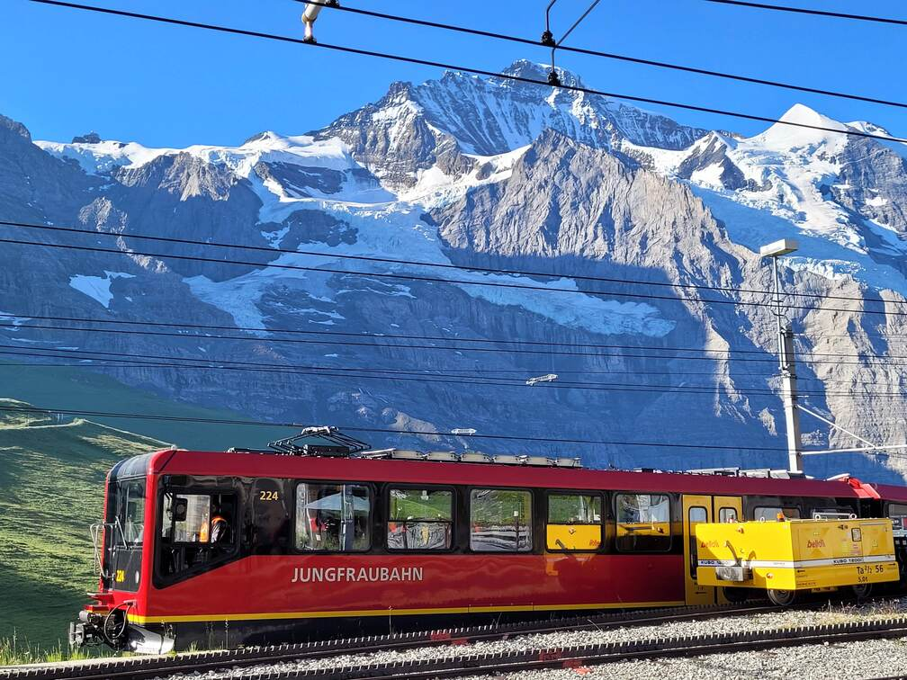
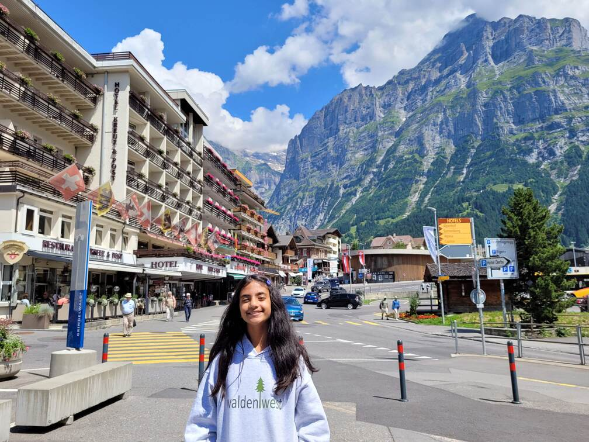
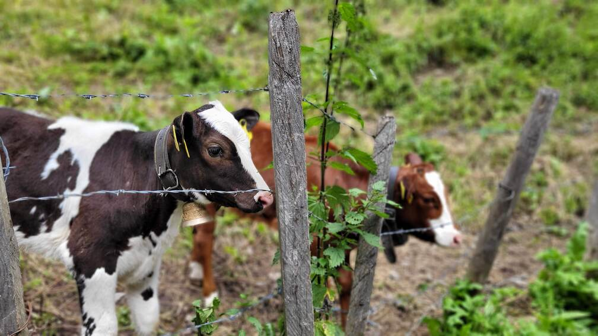
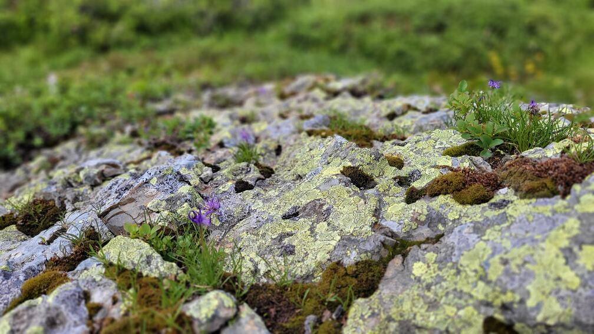
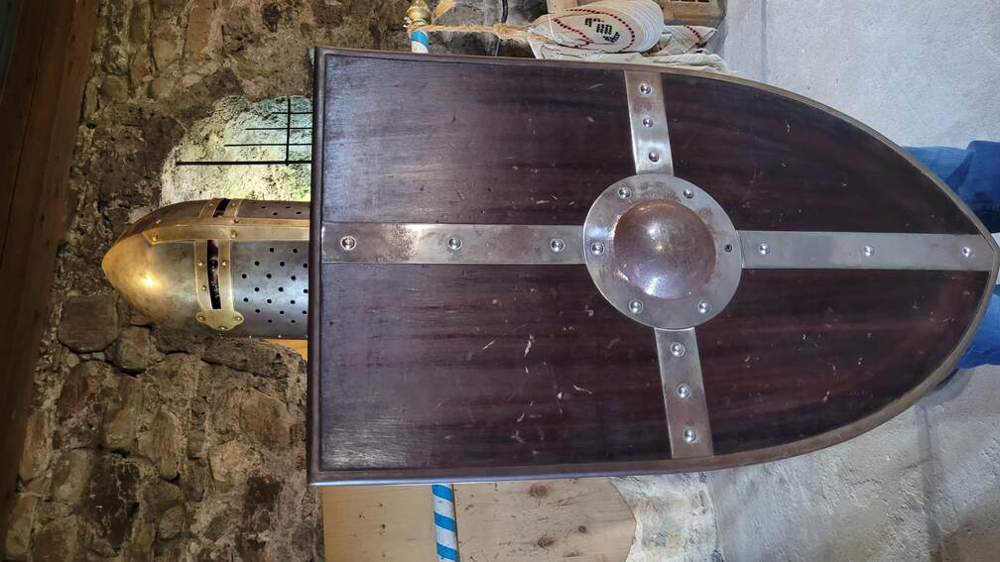
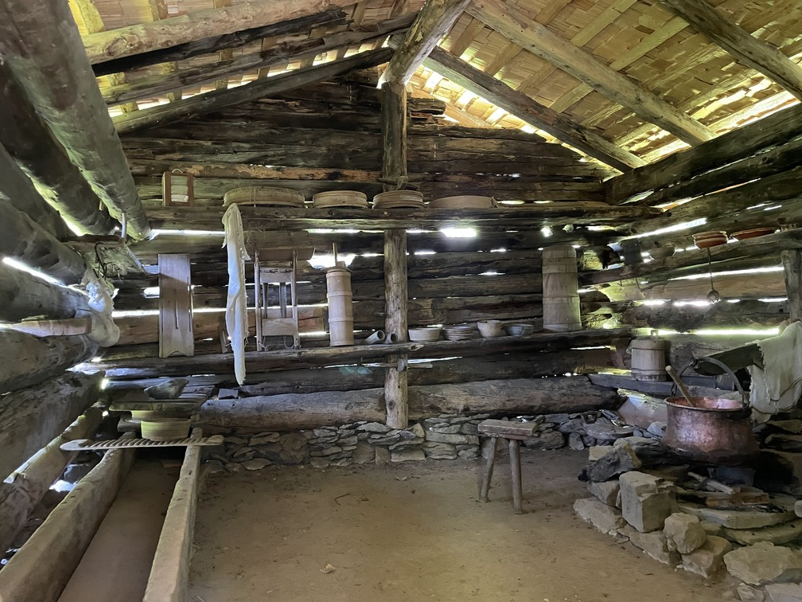
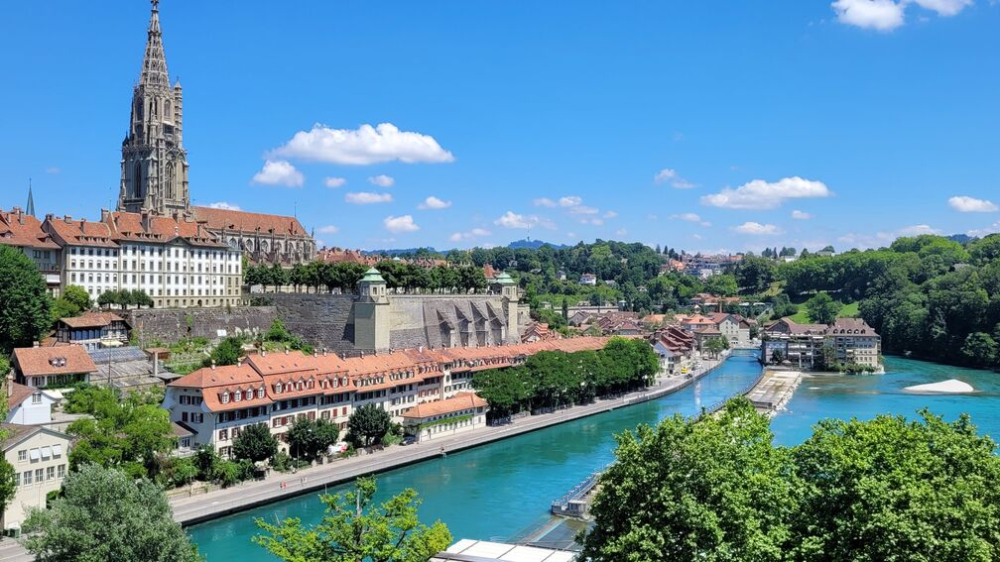
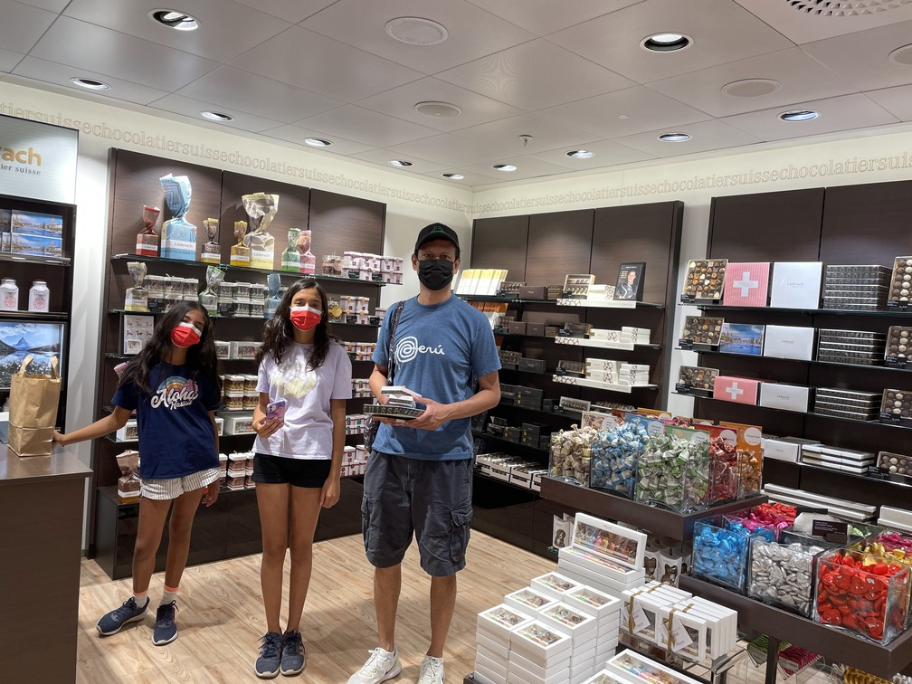
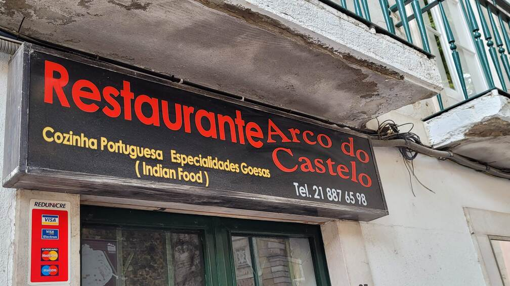

# Switzerland and Portugal, July 2022
### Surf and turf

(Click [here](#photo-gallery) to jump directly to photos)

* [Day 1: Wengen](#day-1-wengen)
* [Day 2: Jungfraujoch, Grindelwald](#day-2-jungfraujoch-grindelwald)
* [Day 3: Schilthorn, Gimmelwald, Lauterbrunnen Valley](#day-3-schilthorn-gimmelwald-lauterbrunnen-valley)
* [Day 4: Mannlichen to Kleine Scheidegg, Spiez](#day-4-mannlichen-to-kleine-scheidegg-spiez)
* [Day 5: Grutschalp to Winteregg, Ballenberg](#day-5-grutschalp-to-winteregg-ballenberg)
* [Day 6: Bern](#day-6-bern)
* [Day 7: Heididorf](#day-7-heididorf)
* [Day 8: Zurich](#day-8-zurich)
* [Day 9: Zurich](#day-9-zurich)
* [Day 10: Downtown Lisbon](#day-10-downtown-lisbon)
* [Day 11: Belem](#day-11-belem)
* [Day 12: Sintra, Cabo da Roca](#day-12-sintra-cabo-da-roca)

---

We were in Switzerland and Portugal for 12 days during the summer 2022 holidays. Sejal has always wanted to visit Switzerland, and we added on Portugal to our trip when we found that the cheapest flight back was Air Portugal's one-stop route via Lisbon.

We booked an 8-day Swiss rail pass - a fantastic value as we found out once we landed there. The pass gives you access to pretty much every train in Switzerland outside of a few special routes, and either free entry into or discounts on a number of other attractions. We did find it a bit confusing to know upfront whether a route was covered by our pass beforehand, but the rail staff was always helpful and it was easy to find out from them.

### Day 1: Wengen

We landed in Zurich at 10 am and took the train straight to our first hotel in the small mountain of Wengen, in the Berner Oberland region that has many of the tallest Alpine peaks. Throughout our trip, we could see why the Swiss rail system is so admired worldwide. The Swiss Rail mobile app offers easy to follow directions on how to get from any location to another in Switzerland, including fairly precise estimations of how long it takes to walk from one platform to another when switching trains. Our three-hour trip from Zurich to Wengen involved changes at Bern, Interlaken and Lauterbrunnen, with only a few minutes between trains, but we were able to complete the journey (and many others during our trip) with no missed connections and generally with time to spare between legs. 

Lauterbrunnen is at the bottom of a steep valley with tall peaks on both sides. The Jungfrau is on one side of the valley and another high peak, the Schilthorn, is on the other. Interlaken, a common destination for tour groups, is outside the core mountain region and is generally useful only as a transit point. The village we were staying in, Wengen, is a so-called "car free" village accessible only by train, high up on the Jungfrau side of the Lauterbrunnen valley. Though it's true that there didn't seem to be any cars in the village (so the designation "car-free" is strictly true), we did see a number of small pickups traveling around the village, so it's not entirely free of motorized traffic.

We had rented a condo in a condo building, with amazing views of the Lauterbrunnen valley and of the Jungfrau mountain itself.

### Day 2: Jungfraujoch, Grindelwald

Our first major excursion from Wengen was to Jungfraujoch, marketed as the "Top of Europe" (this name is only partially true - the Jungfraujoch train station at which tourists get off is indeed the highest rail station in Europe, but there are taller peaks than the Jungfrau in Switzerland). Jungfraujoch is slightly lower than the Jungfrau peak itself. The trip there isn't included in the Swiss Rail Pass and is expensive, about $400 for two tickets (the kids were free), but is worth doing. We paid a small additional fee that allowed us priority boarding on the trains, which helped us save some wait times - lines can be long. The trip up and down takes about 1.5 hours, with a couple of (precisely timed) changes.

The Jungfraujoch train station sits at the center of a well-developed tourist complex. You can go outdoors to walk on the Aletsch Glacier, do a toboggan ride on the snow, walk through an "Ice Palace", and even eat at an Indian restaurant called Bollywood. It took us about 2 hours to see everything in the complex. Even though there is snow everywhere, it was surprisingly not very cold. We had worn thermals and ear coverings, but they turned out not to be necessary. I thought it was typical of Switzerland that even in the most remote tourist destinations, things are still perfectly comfortable and easy to access.

In the Ice Palace, we noticed the almost complete absence of safety related signs - nothing warning people to be careful (even the flooring is ice, making it easy to slip) or disclaiming responsibility in the case of injury, as there would almost certainly be in the US. We noticed this in other places in Europe as well, and chalked it down to more of an expectation that people are responsible, and a lower chance of someone successfully suing the company if they did hurt themselves.

From Jungfraujoch we took two trains down to the town of Grindelwald, also in the mountains but at a much lower elevation. Grindelwald is a small, picturesque town with not much to do, though it is the starting point for gondolas to adventure sports in a nearby town called First.

### Day 3: Schilthorn, Gimmelwald, Lauterbrunnen Valley

The next day we went up the other side of the Lauterbrunnen valley, to the top of the Schilthorn peak. This involved taking a train down to the valley floor and then a few trains and gondolas up to the top. It's worth doing this trip early in the day, since the clouds roll in by late morning. On our trip, we got a clear view of the mountains for an hour or so, but then the clouds moved in surprisingly quickly. The Schilthorn is on the other side of the valley from the three most celebrated (or marketed peaks) in the region - the Monch, the Eiger and the Jungfrau - and so offers spectacular views of all of them on a clear day.

The tourist attractions at the Schilthorn are definitely skimpier than at Jungfraujoch, consisting mainly of a viewing promenade and a James Bond-themed revolving restaurant. The 1969 James Bond movie "On Her Majesty's Secret Service" was shot at the Schilthorn peak, and money from the movie's filming helped complete the half-finished construction of the tourist complex, so there's a strong influence of James Bond throughout - a short movie about the filming of the 1969 movie, a hands-on area with information about the movie, and women's restrooms marked "Bond Girls". Breakfast at the revolving restaurant was worth it for the amazing, slowly changing views.

On the way down from Schilthorn to the valley floor, we did a 45 minute hike from a village called Murren to another, even smaller, village called Gimmelwald, with spectacular views of sheer Alpine peaks throughout. In the Rick Steves Switzerland guidebook, which we used extensively to plan this trip, Gimmelwald comes highly recommended as the base for staying in the Berner Oberland area. We opted to stay in Wengen instead after reading more online, and I believe that was the right decision. Gimmelwald is far too small to be interesting for a several day stay for us, with only a couple of restaurants and no real activities. It's also pretty isolated which didn't appeal to us. We enjoyed our hike there though, one of the most recommended hikes in Rick Steves' book.

After lunch in Gimmelwald, we took a gondola down to the valley floor and visited the Trummelbach Falls, the final point of runoff for melting ice from the Jungfrau and surrounding peaks. This is a spectacular site, and the Swiss engineering that makes it easy to appreciate from up close is equally spectacular: a series of staircases and viewing platforms lead you through the mountain rock to see the waterfall from various angles before it emerges out into the open.

We hiked from the falls to the Lauterbrunnen train station and took the train back up to Wengen. The hike is an easy 45 minute walk on flat terrain, with spectacular views throughout.

### Day 4: Mannlichen to Kleine Scheidegg, Spiez

The next morning we hiked one of the most well-known trails in the area, from a town called Mannlichen high above Wengen to the slightly lower town of Kleine Scheidegg. The route is a relatively easy flat or downhill 1.5 hour walk along a ridge with views of the valley below. We got to Mannlichen by taking a gondola from Wengen, this time paying a few Swiss francs extra for an open air seat on top of the gondola. This was worth it as the car went through a dizzying ascent through fog before emerging at Mannlichen, with spectacular views of both Wengen and Lauterbrunnen further below.

Mannlichen is a remote outpost with no residents (as far as we could tell) but a large and well maintained cafeteria and playground right a short walk from the gondola terminus. It's also connected to several other points the mountains through gondola routes. The hike to Kleine Scheidegg faces the Jungfrau, Eiger and Monch peaks, and although we had a relatively foggy day we caught many glimpses of all these mountains during our hike. There were a number of other hikers on this popular trail, but it was possible to lose them and really feel like we were entirely alone.

The tiny town of Kleine Scheidegg happens to be on the train route to Jungfraujoch, and we had passed through it on our trip up to the "Top of Europe". Calling it a town is probably overstating it - it consists of a train station, a handful of early 1900s-style hotels, and some restaurants and souvenir shops by the train station.

Our lunch in Kleine Scheidegg consisted of sausages and rosti, the Swiss version of hash browns.

From Kleine Scheidegg, we again used the excellent Swiss train system to visit the town of Spiez, which one of our friends had recommended. Spiez is outside the mountain area and in the plains on the banks of the Thun river, so it was a complete change of scenery from our mountainous morning.

Spiez has a pretty castle that we toured, trying on some (very heavy) medieval armor in the process. Entry to the castle is free with the Swiss rail pass.

At this time of year at this latitude (46° N), sunset was at 9.20 pm, meaning that the mountain peaks were bathed in sunlight at what seemed like unearthly hours. This shot of Jungfrau from our condo was taken at 9.08 pm.

### Day 5: Grutschalp to Winteregg, Ballenberg

We checked out of our condo in the morning but wanted to spend more time in the mountains before going to Bern, so we did another of Rick Steves' recommended hikes, from Grutschalp, on the Schilthorn side of the valley, to a small town called Winteregg. This involved taking the train down to Lauterbrunnen and a gondola up to Grutschalp. The Lauterbrunnen train station has a convenient left luggage facility for 5 Swiss francs per piece, though the gruff but kindly lady at the counter gave us a discount by "rounding down" the number of bags we had. We then took a gondola up to Grutschalp.

This was a spectacularly clear day, with crystalline views of the Eiger, Monch and Jungfrau peaks along the entire hike. The trail is flat and easy, and the walk to Winteregg took us about 45 minutes. It's possible to walk a further 90 minutes to the town of Murren (from where another gondola line departs to the Schilthorn, and from where we had earlier hiked to Gimmelwald), but we decided that the walk to Winteregg was long enough.

We saw many reminders that rural Swiss life still exists (and isn't just a show for tourists) along the route, as we had on our Murren-Gimmelwald hike.

After our hike, we were finally done with the Berner Oberland mountains, and took the train via Interlaken to an open air museum called Ballenberg. Interlaken has a surprisingly user-unfriendly system of luggage lockers at the station, where we left our luggage. The lockers only take coins, and only specific denominations, and it took some to and fro trips to nearby stores to get the right types of change. However, we had a good 40 minutes between trains which was just enough time to figure things out.

As in many places in Switzerland, we saw lots of Indian tourists in Interlaken, which is popular as a more accessible and lower-cost gateway to the Alps than areas in the mountains (and has been made popular via Hindi films). 

Ballenberg has lifesize replicas of Swiss buildings from all over the country. In some cases, the buildings aren't even replicas - they are actually buildings hundreds of years old that have been donated to the museum, and transported and re-assembled there! For a relatively small country, Switzerland has a lot of variation in architectural styles (caused partly, I'm guessing, by the variation in terrain between the mountains and the flatter regions), and it's very interesting to see. The museum is laid out in a shape rougly similar to the shape of Switzerland itself, so for example Bernese houses are near the center of the museum, Alpine houses to the south and southwest, etc. It's a large museum and we were only able to see a portion of it, but the kids (as well as both of us) really enjoyed going inside various houses, seeing how they were laid out and imagining life centuries ago in them. Life must have been truly hard in Switzerland, especially in the mountains, before the arrival of modern technology.

An Alpine hut:

A house from 1698!

From Ballenberg there were two ways to get back to Interlaken, from where we would travel on to Bern: a 20 minute train ride or a 90 minute boat ride. The boat ride was also covered by the versatile Swiss Travel Pass, so we opted to take that. It's a beautiful, relaxing journey, with several stops along Lake Brienz before arriving in Interlaken. Interlaken to Bern is about an hour on the train.

### Day 6: Bern

Bern is the (very under the radar) capital of Switzerland, though our guidebook told us that Switzerland does not officially have a capital but only a seat of federal government. The Swiss republic (_Confoederatio Helvetica_) was founded in 1291 with a couple of provinces and appears to have survived in some form till the present day, though most of its current structure dates back "only" to 1848.

Bern is really a small town but felt large after living in the mountains for a few days. Our hotel was right off the Swiss Parliament, visible from our hotel window, and close to the compact historic center.

Bern is where Albert Einstein lived for a few years, including his so-called "miracle year" in 1905 where he published three major papers including the one on the Special Theory of Relativity. The city plays up this connection to Einstein: the house where he lived from 1903 to 1905 has been converted into a fairly skimpy Einstein museum (not covered by the Swiss Travel Pass), and there is an Einstein Museum inside the National Museum in Bern. The Einstein House, though not much to look at, was a cool site to be at.

The only area of the house that you can visit is the living room - everything else is closed off - but there is a small exhibit about Einstein's personal and academic life. Einstein had a bit of a troubled history, abandoning his first daughter (about whom not much is known) and later divorcing his wife to marry his cousin.

Bern also has a well-preserved medieval-era downtown area that we took a walk in - while there are no specific sights here other than a large clocktower, it's a beautiful place well worth half a day.

The Bern National Museum has a variety of Swiss paraphernalia across several centuries, such as the cannon weighing scale below, and a separate Einstein section that repeats a lot of the information that's in the Einstein House museum. (It does make a despairing attempt at explaining the Special Theory of Relativity in a kid-friendly manner, which seems like an enterprise doomed to failure.)

From Bern it's a short train ride to Zurich, which is where we would spend the next three days.

### Day 7: Heididorf

On our first day in Zurich we actually left Zurich to visit a tourist attraction called Heididorf in the eastern Alps nearby. Sejal is a huge fan of the book _Heidi_, which describes the adventures of a young Swiss girl who grows up in the Alps. The book is one of the most widely translated of all time, and Heididorf is a sort of shrine to it, located near the same area of Maienfeld that Heidi lives in.

The train to Heididorf takes about an hour from Zurich. In a strange failure of Swiss planning, there are no weekday buses from the train station to Heididorf, so we walked there (a good 45 minutes, though through lovely country fields) and took a taxi back.

We saw lots of tourists, including people obviously visiting from other countries, making it clear how popular the book is and underscoring how strange it is that there isn't an easy connection from the train station to the tourist area.

Heididorf consists of a number of replicas of locations mentioned in the book: the alpine hut that Heidi lives in with her grandfather in the summer, their winter house down in the village at the foot of the Alps, the village schoolhouse, and so on, plus a small museum and gift shop. Many of these replicas have life-size models of the main characters from the book: Heidi, her goatherd friend Peter, her grandfather, and her friend from Frankfurt Klara (where she is shipped by her aunt to live, and accounts for much of the story in the book). The whole thing is clearly touristy and geared toward fans of the book, but is an enjoyable day trip.

### Day 8: Zurich

We spent the next day walking around Zurich, and - since we were going to leave Switzerland for Portugal the next day - catching up on our souvenir and gift shopping. There is a massive underground shopping complex under Zurich's train station from where we got lunch to eat at a nearby park, and Laderach chocolates to gift to friends.

Zurich has a small, easily walkable central core along Lake Zurich with restaurants, shops and cathedrals. While there aren't any major stand-out sights, we enjoyed strolling along the lake and watching the people.

Surprisingly for us, almost everyone in Switzerland was mask-free, even on crowded public transit. When we visited, even the requirement to isolate if you have Covid had been lifted, so things were almost entirely back to normal. It was a bit strange for us coming from California to be in large groups of people entirely mask-free, and while we kept our masks on in most places we did notice that later in our trip we were more comfortable being maskless among groups of people.

Another thing we noticed coming from California was that the quality of service in most places was generally better than we were used to. This was a surprise, having heard generally negative things about European service, but in Switzerland at least most of our interactions with store clerks, waitstaff and cashiers came with smiles. People seemed to be happy in general, perhaps a result of the fact that most people are relatively well paid, and when we had trouble figuring out the system - for example in some supermarkets - someone would always help graciously.

### Day 9: Zurich

On our last day in Switzerland, we visited the Swiss National Museum in Zurich, just next to the train station and a few minutes' walk from our hotel. Aryaa and Aayati are both history buffs and were very interested in a temporary Anne Frank exhibit, and the rest of the museum was also recommended by our guidebook. The Anne Frank exhibit (the full name of which was _"Anne Frank und die Schweiz"_, or "Anne Frank and Switzerland") tries to draw a connection between Anne Frank and the country, though in reality there was only a very tenuous link through some relatives who fled from Germany to Switzerland (Anne Frank herself fled the other way, to Amsterdam, where the family was eventually discovered by the Nazis). Nevertheless, it was a moving exhibit filled with a mix of artifacts and information where we spent a couple of hours.

The rest of the museum has hundreds of exhibits from different eras of Swiss history, similar to the museum in Bern but larger.

A William Tell goblet from 1780:

Posters like the below were used to advertise the Swiss Alps as a vacation destination to the wealthy of Europe starting in the 1800s:

A bullet-riddled Swiss flag from the Swiss embassy in Berlin from the Second World War:

Later that afternoon, we took a flight from Zurich to Lisbon to begin the Portuguese portion of our trip. Zurich airport is small and overcrowded, with tons of flights leaving at the same time and people everywhere (almost all without masks). It was a marked contrast from the smooth efficiency of the train system.

We flew to Lisbon on the famously chaotic Portuguese national airline, TAP Air Portugal. Our short flight was generally uneventful, though again at Lisbon airport we were reminded that planes are second-class modes of transport in Europe to trains - we had to wait a long time to disembark, disembark directly on the tarmac rather than via jetway, and then wait a seemingly interminable amount of time in a non-airconditioned bus in 100 degrees F (38 degrees C) weather till we finally made it into the terminal. There are no immigration checks in Portugal, even though we were coming from a non-Schengen country, because Schengen and Swiss immigration had been handled together when we had arrived in Zurich.

### Day 10: Downtown Lisbon

Our hotel in Lisbon was a wonderful renovated apartment in the historic downtown area. Lisbon has some gritty, rundown areas that are a marked contrast from Switzerland's pristine towns, but we found the city fascinating and exciting to walk around, with a definite buzz and vitality that was refreshing. The weather was hot and humid, with temperatures in the 90s F (30s C) during our entire trip, with high humidity. Lisbon reminded us of various seaside towns we had been to.

Throughout our stay in Portugal we marveled at the low costs - especially pronounced after several days of shockingly high Swiss prices. While it seemed hard to get an entree in Switzerland for under $20, we had entire meals in Portugal for four people under $40. It was interesting to see the contrast in prices, partially explained by the difference in development levels (Portugal's per capita GDP is about one-fourth that of Switzerland), even within Europe.

Our first visit in Lisbon was to the Moorish-era castle of Sao Jorge (St. George), on a hill overlooking the city. ("Moors" is the European name for Muslim invaders from Africa and the Middle East who occupied most of Spain and Portugal from the 800s through to the 1400s.) The castle has no interior areas - it's mostly a shell with walls, though worth visiting for its views of the city. Groups of peacocks brought back from India to Portugal by traders in the 1500s live in the castle and roam freely on the castle grounds.

Something we knew before we went to Lisbon (courtesy of the Netflix show "Somebody Feed Phil") was that there are some Goan restaurants, and we had planned to eat at one when we were there. We found one right outside the castle, and had lunch there.

A characteristic Portuguese alcoholic drink is a cherry liqueur called _ginjinha_, served in $1 shot glasses at hole-in-the-wall shops all over the city. We had to try it on our first day, and are pleased to report that it was delicious.

Aayati has recently become very interested in sewing, and was able to buy some Portuguese-styled cloth from a store in the downtown area from which to make a skirt.

### Day 11: Belem

Belem is a suburb of Lisbon about 30 minutes from downtown by tram. Like San Francisco, Lisbon has a lovingly maintained tram system that appears to be in equal parts built for locals and tourists. Traveling on the trams is a tourist experience in itself.

Portugal's golden age was in the 1500s and 1600s - the so-called "Age of Discovery" - when it established colonies in South America, Africa and Asia and was one of the most powerful countries in the world. Since then, it appears to have suffered a stagnation (perhaps more accurately a relative decline) over several centuries, being overtaken by Britain and other European powers in the 1700s and 1800s. A large event in the collective Portuguese imagination is the landing of Vasco da Gama in Calicut, India, in 1498, which started a trade in spices with India and other Asian countries that made the Portuguese very rich. 

As a case in point, the Jeronimo Monastery in Belem, one of the top tourist sights in Portugal, was funded via a 5% tax on spices brought back from India and other Asian locations by Portuguese traders. It's an opulent structure with a vast church area and Vasco da Gama's tomb. Vasco da Gama died in India in 1524, and his remains were repatriated to Portugal.

Near the Jeronimo Monastery, a tower called the "Monument to the Discoveries" pays homage to Portugal's golden age. At the base of the tower, a world map mural shows the years in which Portuguese explorers landed in various regions of the world - often the first people in Europe to prove that there was a way to get to those areas by sea. For example, before Portuguese explorers rounded the southern tip of Africa, it was unknown (in Europe) whether it was possible to reach India and China by sea.

The Monument to the Discoveries shows a number of important people from Portuguese history in an attitude of striving (perhaps hoping for the next big discovery).

The weather in Lisbon was sultry enough that we got into the tropical habit of taking an afternoon nap between our morning and evening sightseeings. In the late evening, we visited a show called "Lisbon under the stars", a slick musical production staged in a 1300s-era cathedral. The musical shows various eras of Lisbon's history set to dance and music, projected on the walls of the cathedral. It's a slightly surreal but interesting experience.

### Day 12: Sintra, Cabo da Roca

On the last day of our trip, we took a day trip to a town called Sintra about 45 minutes by train from Lisbon. Sintra is a popular second home location for wealthy Lisbon residents and has a couple of historic castles, including another Moorish-era castle. Unfortunately, Portugal (and Europe in general) was experiencing a heat wave, and the authorities had decided to close all tourist sights in Sintra on the day we visited due to the danger of forest fires.

Once we realized this on arrival in Sintra (like us, many other tourists were apparently also learning about it after arriving there), we hired a tour guide for a three-hour tour of the general area. Indian-style rickshaws (called "tuktuks") seem to be making inroads into Europe - we saw some in Bern, and Lisbon seems overrun with them. Sintra also had a bunch of these tuktuks at the station, with drivers-slash-tour-guides ready to make the most of the closing of the tourist sights by offering tours of the surrounding area. Our guide happened to be a Sikh whose family had emigrated from Punjab to Portugal before he was born, which meant he had grown up entirely in Portugal and had never visited India - an interesting migration pattern that we weren't expecting.

Sintra is a nice medieval town with some interesting buildings, but the highlight of our tour was when our guide took us to the coast, which is close by.

We visited a couple of spots including Cabo da Roca, the westernmost point in continental Europe. The views were spectacular.

After an evening around the Lisbon downtown core, we flew back from Lisbon to San Francisco the next morning. Our trip was full of fantastic experiences, and throughout our trip we found friendly, kind people who made our trip even better.

## Photo Gallery

Click on any photo to view it in full resolution.


