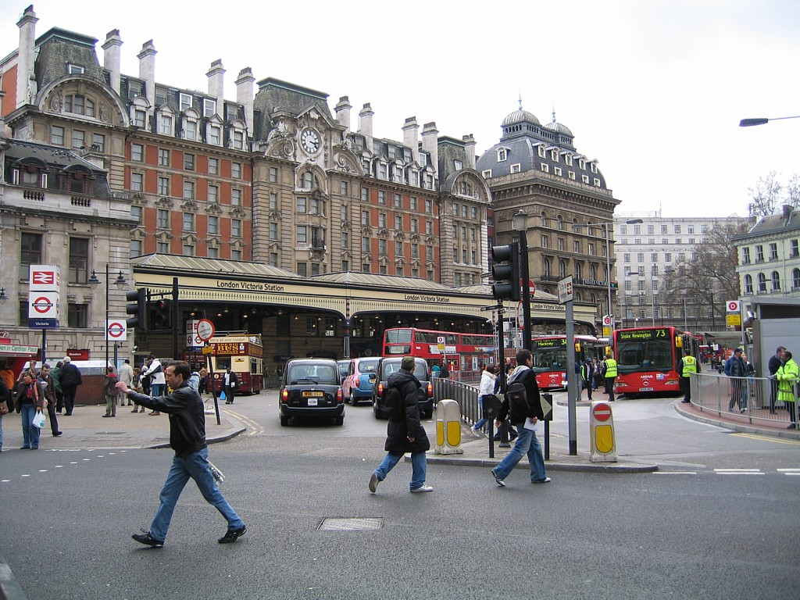
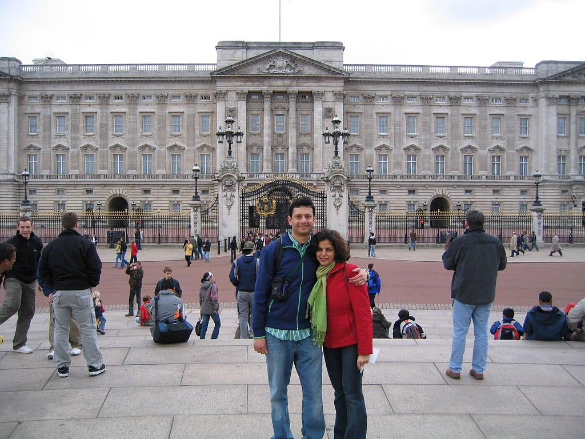
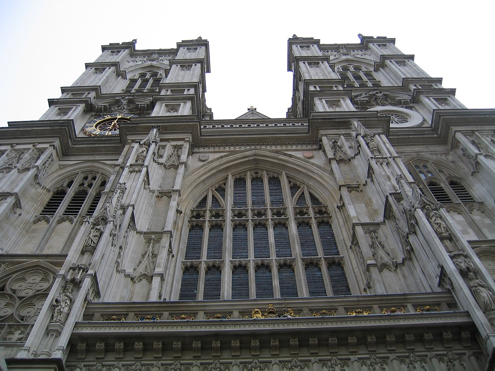
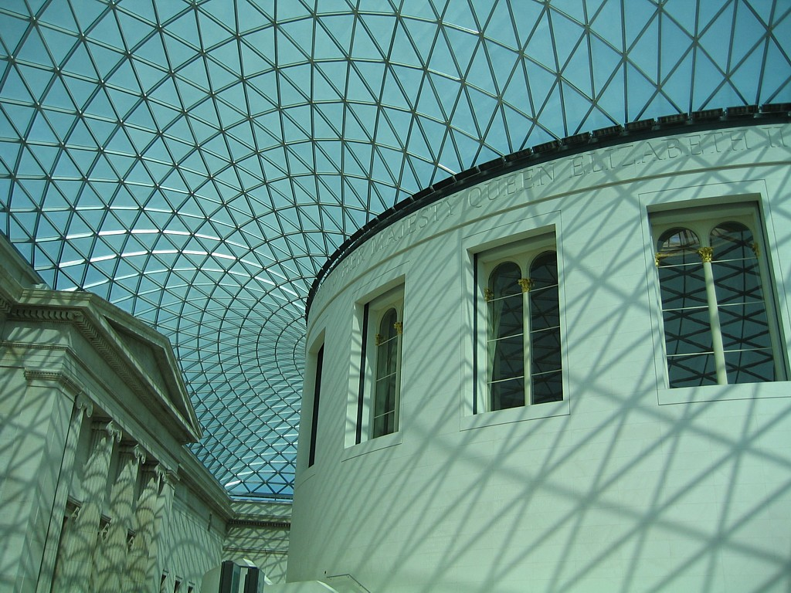
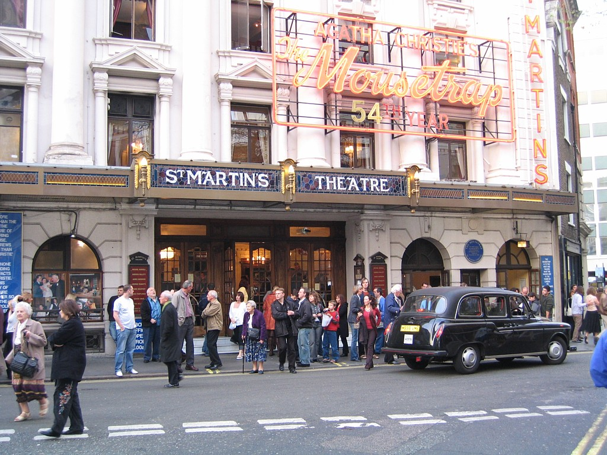
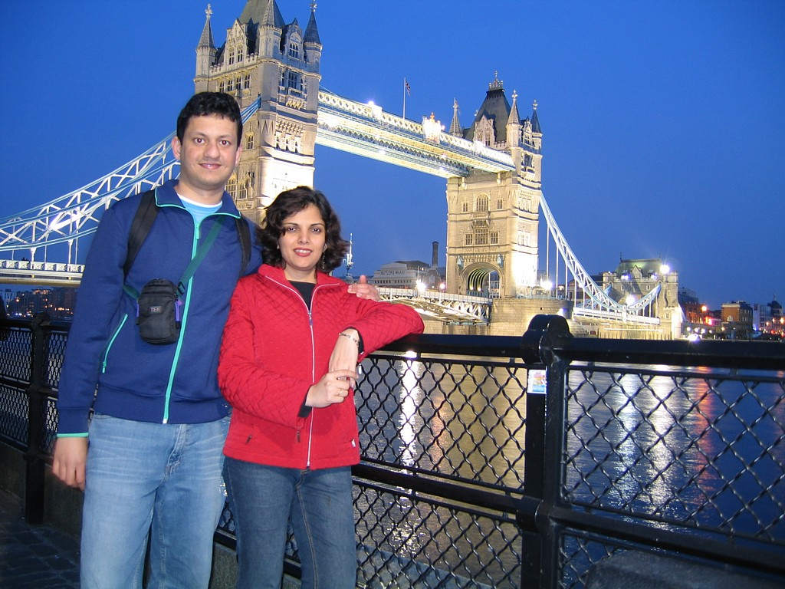
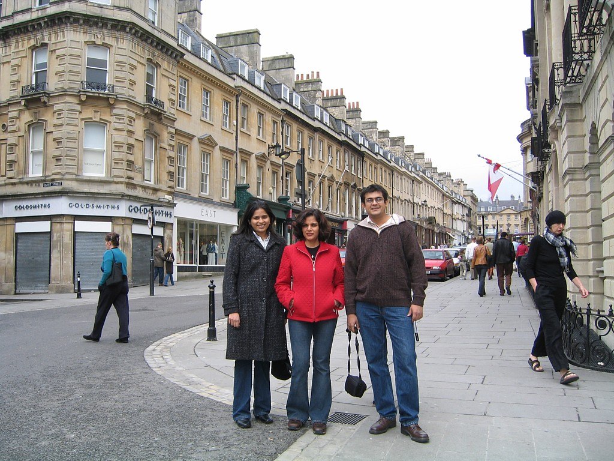
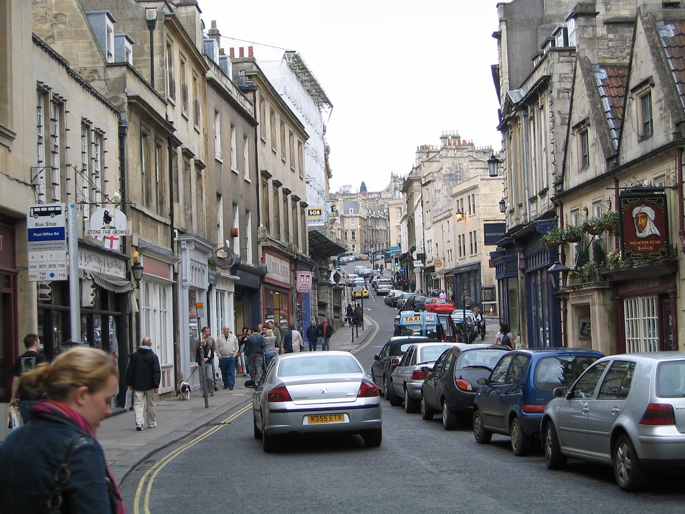
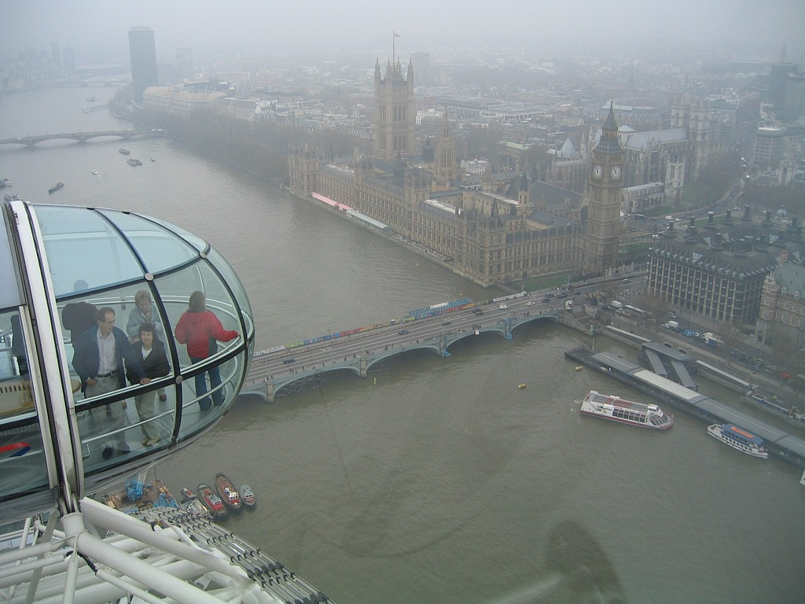

# UK, France and Italy, April-May 2006

(Click [here](#photo-gallery) to jump directly to photos)

* [Dispatch 1: London (April 22, 2006)](#dispatch-1-london-april-22-2006)
* [Dispatch 2: London, Bath (April 26, 2006)](#dispatch-2-london-bath-april-26-2006)

---

### Dispatch 1: London (April 22, 2006)

We thought we would send out an email update about the progress of our trip. Things have been fantastic so far. We reached London two days back at 1 pm, and were in our hotel by 4. To fight jetlag we decided to stay awake till night time here, so we walked around in the area near our hotel. Our hotel is very centrally located, in an area of London called Westminster, near many of the major tourist sights. Victoria Station, which is the closest station to our hotel, is built in the same Gothic style as VT in Bombay. It felt strange the first day walking around the city and seeing red double-decker buses, and the station names on the Underground railway that have the same design (a red circle with a blue horizontal bar through it) as the local train stations in Bombay. 

We walked around Buckingham Palace the first day, seeing the bored guards in their bizarre fur hats marching through the grounds.

That night we took a 2-hour "London by Night" bus tour. This gives you an opportunity to see most of the major sights in London all lit up, and we thoroughly enjoyed it even though the temperature on the uncovered top floor of the bus was close to freezing.

We went to Westminster Abbey yesterday morning, taking a good look at Big Ben on the way. Rarely for such a famous monument, Big Ben looks much better in real life than in photos, with a lot of intricate detail work on the outside and near the clock face that didn't seem to have come across in most of the photos I've seen. Big Ben is actually the name of the clock, not the tower. Westminster Abbey is the place where (almost) every famous Britisher ever born seems to have been buried. It's still a working church, and once every hour that we were inside there was an announcement to stand still and observe "a moment of reflection". The abbey has been used for burials since 1066 AD, so there are a lot of famous names in there. The audioguides that we rented made the visit much more meaningful since we got a lot of background detail on the names that we wouldn't otherwise. Many English poets (Keats, Browning, Wordsworth, but not Shakespeare), kings and queens, and even old officials of the East India Company are buried in this one place.

Later in the day we visited the National Gallery just behind Trafalgar Square, which has a large number of famous paintings mainly by Western artists. We liked one painting so much that we wanted to get a print of it, and we came across the Gallery's very slick print ordering system. They have a computer terminal with pretty much every painting in the Gallery listed, you choose a painting and a size in which you want to get it printed, and the print is available to you in 7 minutes. The reproduction quality was very good.

For dinner we met a friend of Abhi's from college days, Sandeep Soni, who works in London. We went to an Indian restaurant near our hotel since Indian food seems so popular in the UK. Sandeep told us that 90% of the "Indian" restaurants in London are actually run by Bangladeshis, and this stereotype turned out to be accurate in the restaurant we went to. Things seem to be roughly twice as expensive in London as the Bay Area. On restaurant menus the prices seem reasonable numerically for dollar prices in California (8+ for an entree), but they are in pounds (for which the exchange rate is 1.80 dollars per pound or so). This is more expensive than in any other city we've been to.

Today we spent much of the day visiting the British Museum (which has huge numbers of statues and cultural artifacts from Greece and Rome, and smaller collections for India, China, and other parts of the world), and the British Library (which has originals of many old books and documents, including the original Magna Carta from 1215; the first printed Bible in Europe; and a collection of Shakespeare's "comedies and tragedies" published in 1625, just 9 years after his death). Some of the old Indian sculpture in the British Museum includes a statue of Lord Ganesha from the 7th century AD, and a very intricately carved, 13th century, Shiva and Parvati statue. The Museum was established in 1753 and due to the extents of the ex-British Empire has been supplemented with material from most regions of the globe since then.

We wanted to see a play in London's famous West End area, so this evening we saw a 5 pm (cheaper) showing of "The Mousetrap" at St Martin's Theater, where it is now in its 54th year. Even though Abhi had seen it a few years ago in India and vaguely remembered who the killer was, it was spell-binding for both of us, with great acting and suspense. 

Around twilight we went to see the famous Tower Bridge, which was spectacular, although both of us had been somewhat surprised to learn a couple of days back that the Tower Bridge and the London Bridge are not the same thing. The London Bridge is another, very non-descript bridge, while the Tower Bridge is the one that's a London landmark with its two characteristic towers.

We'll be writing more as we get Internet access on this trip. Hope you enjoy reading these.

### Dispatch 2: London, Bath (April 26, 2006)

On Sunday, we had planned to meet a friend of Abhi's from school, Chetan Somaiya (who lives near London and works in a hospital in the city) and visit a place called Bath with him and his wife. Bath itself is a beautifully-preserved 18th century town about 130 miles from London, but its main highlight is a series of public baths built during the Roman occupation of Britain 2000 years ago. The Romans invaded and ruled Britain from the 1st to the 4th centuries AD, and the baths here are one of their biggest structures in Britain. We had an excellent time chatting with Chetan and his wife on the two hour drive to Bath, especially enjoying views of the foggy English countryside during the drive. The baths are quite impressive, although the audio tour guides that we rented did a slightly <i>too</i> thorough job of describing every nook and cranny of the place. We learnt more than we ever needed to know about the bathing characteristics of the ancient Romans. 

The rest of the town surrounding the baths was more interesting than the baths themselves, and we spent a couple of very interesting hours looking at many of the old, well-preserved Georgian-era buildings, as well as having lunch at an authentic English pub where the food lived up to the reputation of British cuisine. That was all the excitement we had planned for the day, but fate had other plans. About 40 minutes into our return trip to London, Chetan's car broke down on the M4 "motorway" (or freeway), and he had to call a towing service to transport his car (as well as us) back to his home. It wasn't the perfect end to the day, but it gave us an interesting look at how the RAC (Royal Automobile Club, the UK's equivalent of the AAA in the US) provides roadside assistance, and we got a chance to visit Chetan's apartment.

On Monday, our last day in London, we took a ride on the London Eye, the largest ferris wheel in the world, towering above the London skyline across the Thames river from Big Ben. One ride on the wheel takes 30 minutes and gives you a fantastic bird's eye view of the neighboring sights - Big Ben, the Houses of Parliament, and Westminster Abbey. The day was a bit foggy, so it wasn't the ideal weather for the ride, but it was still a great experience.

Our final stop in London was at the St. Paul's Cathedral, a beautiful structure built to the replace the previous church that burned down in the Great Fire of London in 1666. We didn't have enough time to take a tour of the entire interior of the cathedral, but the parts we saw were very impressive and reminiscent of Westminster Abbey.

That same evening we took the Eurostar train from London to Paris, a 2.5 hour marvel of a train ride that transports you under the English Channel with a minimum of fuss. Immigration and security procedures are the same as at an airport and take place on the London side. The train left London's Waterloo station at 5.42 pm, and we were in Paris by 9.17 pm local time (which is one hour ahead of England). It was a surprisingly underwhelming experience, which in itself is a tribute to the engineering that has gone into the train.

We're running out of time at this Internet cafe, so we'll stop this travelogue here. Will write more as we get a chance. We're in Nice now and enjoying the warm weather.

## Photo Gallery

Click on any photo to view it in full resolution.


