# UK, France and Italy, April-May 2006

(Click [here](#photo-gallery) to jump directly to photos)

* [Dispatch 1: London](#dispatch-1-london)
* [Dispatch 2: London and Bath](#dispatch-2-london-and-bath)
* [Dispatch 3: Paris and the French Riviera](#dispatch-3-paris-and-the-french-riviera)
* [Dispatch 4: Nice and Venice](#dispatch-4-nice-and-venice)
* [Dispatch 5: Venice and Florence](#dispatch-5-venice-and-florence)
* [Dispatch 6: Florence, Siena and Rome](#dispatch-6-florence-siena-and-rome)

---

### Dispatch 1: London

We thought we would send out an email update about the progress of our trip. Things have been fantastic so far. We reached London two days back at 1 pm, and were in our hotel by 4. To fight jetlag we decided to stay awake till night time here, so we walked around in the area near our hotel. Our hotel is very centrally located, in an area of London called Westminster, near many of the major tourist sights. Victoria Station, which is the closest station to our hotel, is built in the same Gothic style as VT in Bombay. It felt strange the first day walking around the city and seeing red double-decker buses, and the station names on the Underground railway that have the same design (a red circle with a blue horizontal bar through it) as the local train stations in Bombay. 

We walked around Buckingham Palace the first day, seeing the bored guards in their bizarre fur hats marching through the grounds.

That night we took a 2-hour "London by Night" bus tour. This gives you an opportunity to see most of the major sights in London all lit up, and we thoroughly enjoyed it even though the temperature on the uncovered top floor of the bus was close to freezing.

We went to Westminster Abbey yesterday morning, taking a good look at Big Ben on the way. Rarely for such a famous monument, Big Ben looks much better in real life than in photos, with a lot of intricate detail work on the outside and near the clock face that didn't seem to have come across in most of the photos I've seen. Big Ben is actually the name of the clock, not the tower. Westminster Abbey is the place where (almost) every famous Britisher ever born seems to have been buried. It's still a working church, and once every hour that we were inside there was an announcement to stand still and observe "a moment of reflection". The abbey has been used for burials since 1066 AD, so there are a lot of famous names in there. The audioguides that we rented made the visit much more meaningful since we got a lot of background detail on the names that we wouldn't otherwise. Many English poets (Keats, Browning, Wordsworth, but not Shakespeare), kings and queens, and even old officials of the East India Company are buried in this one place.

Later in the day we visited the National Gallery just behind Trafalgar Square, which has a large number of famous paintings mainly by Western artists. We liked one painting so much that we wanted to get a print of it, and we came across the Gallery's very slick print ordering system. They have a computer terminal with pretty much every painting in the Gallery listed, you choose a painting and a size in which you want to get it printed, and the print is available to you in 7 minutes. The reproduction quality was very good.

For dinner we met a friend of Abhi's from college days, Sandeep Soni, who works in London. We went to an Indian restaurant near our hotel since Indian food seems so popular in the UK. Sandeep told us that 90% of the "Indian" restaurants in London are actually run by Bangladeshis, and this stereotype turned out to be accurate in the restaurant we went to. Things seem to be roughly twice as expensive in London as the Bay Area. On restaurant menus the prices seem reasonable numerically for dollar prices in California (8+ for an entree), but they are in pounds (for which the exchange rate is 1.80 dollars per pound or so). This is more expensive than in any other city we've been to.

Today we spent much of the day visiting the British Museum (which has huge numbers of statues and cultural artifacts from Greece and Rome, and smaller collections for India, China, and other parts of the world), and the British Library (which has originals of many old books and documents, including the original Magna Carta from 1215; the first printed Bible in Europe; and a collection of Shakespeare's "comedies and tragedies" published in 1625, just 9 years after his death). Some of the old Indian sculpture in the British Museum includes a statue of Lord Ganesha from the 7th century AD, and a very intricately carved, 13th century, Shiva and Parvati statue. The Museum was established in 1753 and due to the extents of the ex-British Empire has been supplemented with material from most regions of the globe since then.

We wanted to see a play in London's famous West End area, so this evening we saw a 5 pm (cheaper) showing of "The Mousetrap" at St Martin's Theater, where it is now in its 54th year. Even though Abhi had seen it a few years ago in India and vaguely remembered who the killer was, it was spell-binding for both of us, with great acting and suspense. 

Around twilight we went to see the famous Tower Bridge, which was spectacular, although both of us had been somewhat surprised to learn a couple of days back that the Tower Bridge and the London Bridge are not the same thing. The London Bridge is another, very non-descript bridge, while the Tower Bridge is the one that's a London landmark with its two characteristic towers.

We'll be writing more as we get Internet access on this trip. Hope you enjoy reading these.

### Dispatch 2: London and Bath

On Sunday, we had planned to meet a friend of Abhi's from school, Chetan Somaiya (who lives near London and works in a hospital in the city) and visit a place called Bath with him and his wife. Bath itself is a beautifully-preserved 18th century town about 130 miles from London, but its main highlight is a series of public baths built during the Roman occupation of Britain 2000 years ago. The Romans invaded and ruled Britain from the 1st to the 4th centuries AD, and the baths here are one of their biggest structures in Britain. We had an excellent time chatting with Chetan and his wife on the two hour drive to Bath, especially enjoying views of the foggy English countryside during the drive. The baths are quite impressive, although the audio tour guides that we rented did a slightly <i>too</i> thorough job of describing every nook and cranny of the place. We learnt more than we ever needed to know about the bathing characteristics of the ancient Romans. 

The rest of the town surrounding the baths was more interesting than the baths themselves, and we spent a couple of very interesting hours looking at many of the old, well-preserved Georgian-era buildings, as well as having lunch at an authentic English pub where the food lived up to the reputation of British cuisine. That was all the excitement we had planned for the day, but fate had other plans. About 40 minutes into our return trip to London, Chetan's car broke down on the M4 "motorway" (or freeway), and he had to call a towing service to transport his car (as well as us) back to his home. It wasn't the perfect end to the day, but it gave us an interesting look at how the RAC (Royal Automobile Club, the UK's equivalent of the AAA in the US) provides roadside assistance, and we got a chance to visit Chetan's apartment.

On Monday, our last day in London, we took a ride on the London Eye, the largest ferris wheel in the world, towering above the London skyline across the Thames river from Big Ben. One ride on the wheel takes 30 minutes and gives you a fantastic bird's eye view of the neighboring sights - Big Ben, the Houses of Parliament, and Westminster Abbey. The day was a bit foggy, so it wasn't the ideal weather for the ride, but it was still a great experience.

Our final stop in London was at the St. Paul's Cathedral, a beautiful structure built to the replace the previous church that burned down in the Great Fire of London in 1666. We didn't have enough time to take a tour of the entire interior of the cathedral, but the parts we saw were very impressive and reminiscent of Westminster Abbey.

That same evening we took the Eurostar train from London to Paris, a 2.5 hour marvel of a train ride that transports you under the English Channel with a minimum of fuss. Immigration and security procedures are the same as at an airport and take place on the London side. The train left London's Waterloo station at 5.42 pm, and we were in Paris by 9.17 pm local time (which is one hour ahead of England). It was a surprisingly underwhelming experience, which in itself is a tribute to the engineering that has gone into the train.

We're running out of time at this Internet cafe, so we'll stop this travelogue here. Will write more as we get a chance. We're in Nice now and enjoying the warm weather.

### Dispatch 3: Paris and the French Riviera

A couple of days back, we were in Paris for Sejal's birthday, having arrived there from London the previous night by the Eurostar train. Since we had been to Paris four years ago, we planned to spend only this one day in Paris, seeing some of the sights we hadn't got to last time and revisiting one which we had. When we had gone to the Palace of Versailles four years ago, it was closed, and we had only been able to take a tour of the gardens and minor palaces on the grounds, so this time we were determined to see the main chateau. Every tourist in Paris seemed to have the same idea, however, since it was a Tuesday and the museums in Paris are closed on that day. We were greeted by a line almost a quarter of a mile long, which we were able to skip because we had a Paris museum pass (thanks to the warnings of our trusty guide). We spent the next couple of hours dodging innumerable tour groups inside the palace, with their guides loudly describing each room of the palace in excruciating detail and seemingly in every major language in the world. The palace is worth seeing even with all the noise and crowds, however, each of its many rooms filled with works of art both sculpted as well as painted on the walls and ceilings. This is the palace where the mob came for Marie Antoinette ("let them eat cake") when the French Revolution happened, and looking at the sheer opulence of each room in this palace it's not hard to see why the general population might have been a little disgruntled.

During the rest of our day in Paris, we visited St. Chapelle, a beautiful 13th century Gothic cathedral; climbing to the top of the Arc de Triomphe and looking at the crazy traffic patterns that the cars below make, converging on the Arc in a circle from 12 directions around it; and finally, visiting the Eiffel Tower at sunset. We had visited the last two during our previous visit but they are pretty much worth going to on every trip to Paris, I think. Even the presence of a large crowd of noisy high school kids from Spain, apparently visiting the Eiffel Tower as some sort of school trip and talking loudly every minute among themselves, could not dampen too much the experience of getting to the highest point in Paris and looking around after the lights have come on.

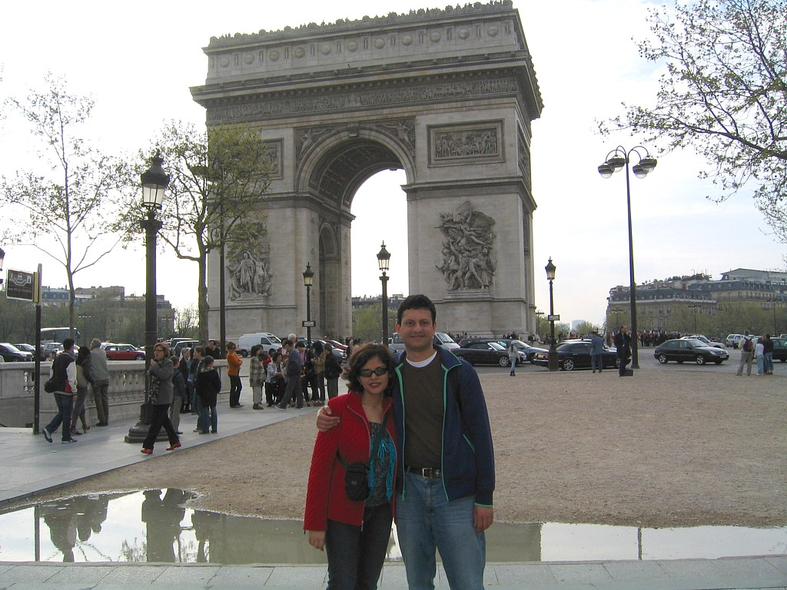

Yesterday we took the train down from Paris to Nice on the southern coast of France. The "TGV" ("train a grande vitesse", or super-fast train) makes the journey in about 5.5 hours, reaching a top speed of more than 300 kmph. We left early in the morning and were here in the early afternoon. The man next to us at lunch seemed to be having nothing but a bottle of wine and a cigarette - and this was in a fast food restaurant. We were definitely in France.

After a few days of cold and rainy London weather and slightly warmer but still cloudy Paris weather, being thrust into the Mediterranean spring was a good change. It was sunny and warm when we got here yesterday, and we spent the rest of the day walking along the beach, with its distinctive swathes of blue chairs spread out by many of the beachside hotels, and exploring the old town of Nice. Nice is only a few miles from the Italian border and has many Italian influences - small gelato shops everywhere, more pizza and pasta places than French restaurants, and a straggle of narrow streets between buildings within touching distance of each other. The pizza is traditional Italian pizza with a thin crust - the last time we were asked whether we wanted a "pan crust" was in a Pizza Hut in London.

"Vieille Nice", or Old Nice, is filled with restaurants and shops catering to the deluge of tourists. The architecture is very photogenic, but we're not sure how pleasant to live in many of those picturesquely weathered old buildings are.

For such a famous beach city, it's somewhat surprising that the beach in Nice is not sandy at all, but made of pebbles of widely varying sizes. Walking or sitting on it is not very easy, but this doesn't deter the many sunbathers who even at this early part of the season spread out along its many miles. In a couple of months, when summer arrives in earnest, there will not be enough space to walk on the beach.

The French Riviera, of which Nice is one city, extends all along the hilly southern coast of France upto the Italian border. Monaco (a separate country, technically, but a part of France for most practical purposes) lies along this coast about 15 miles from Nice, and we went there in the morning today. The famous Monte Carlo casino is nice to look at, and all the Rolls Royces, Bentleys and Jaguars parked outside are very impressive, but there is little to do there unless you have a few thousand euros to get rid of. We enjoyed losing some money at one of the casinos there and were done with our sightseeing there in a couple of hours.

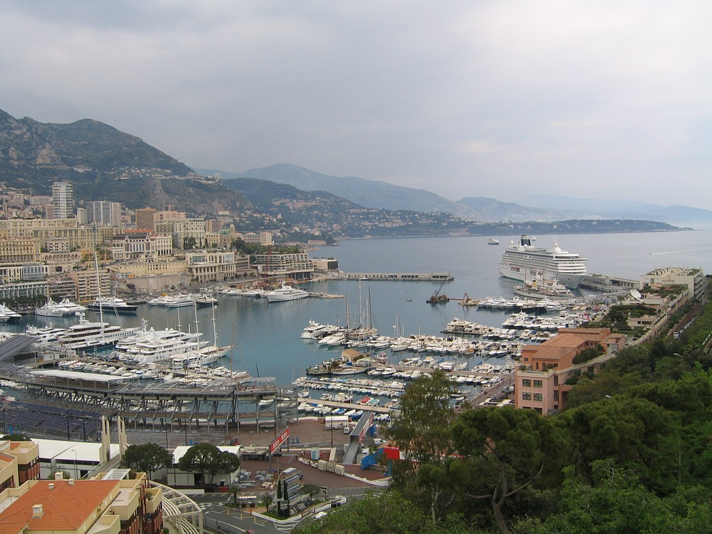

The highlight of the day was an afternoon trip we took to a small village called Eze, perched on a hillside high above the Riviera coast, that is also close to Nice. The views both from the village and while going there by bus are breathtaking. The engineering that has gone into making roads all along this extremely hilly coast, and allowing remote villages like Eze to survive while also having access to modern conveniences, is very impressive.

Tomorrow we leave for Venice, and we'll write more from there. Hope you enjoyed reading this part of the travelogue.

### Dispatch 4: Nice and Venice

We spent our last morning in Nice wandering around the beachfront area and visiting an old Russian cathedral, with the characteristic "onion dome" look typical of churches in Moscow, built in the 19th century for Russian vacationers in Nice. It looks bizarrely out of place surrounded by the Mediterranean architecture of the rest of the city, but is an interesting sight. 

In the early afternoon we took a long, 9.5 hour train journey to Venice, on the eastern, Adriatic Sea coast of Italy. During the first leg of our journey, from Nice to Milan, we had an interesting conversation with the other two people in our six-seater train compartment. This was a British lady and her Italian husband, about 60 years old, traveling to Milan to visit his family. They seemed to have traveled around a lot in Europe, and the husband especially enthusiastically described every place in Italy that we were planning to visit, and some we weren't. Like the national stereotypes of the revolutionarily-inclined French and the stiff upper lip British ("the English never moan about anything", he said) that he brought up during the course of the conversation, he seemed to conform to the stereotype of the talkative Italian. When the food service came around during the middle of the journey, he spoke with the attendant in rapid fire Italian, and then translated it for us later - in a couple of minutes he had extracted the fact that it had been the train attendant's lifelong wish to visit London, and that he had a son who was lactose-intolerant, and so could only drink soy milk, like our co-passenger. It was an enjoyable, nearly 5-hour journey to Milan.

We reached Venice late last night and didn't have much time to look around us then. The absurdity of having a city where the only motorable roads are waterways struck us only this morning as we lined up at the "bus" stop. 

The bus is a pretty big boat that runs up and down the Grand Canal, the main "highway" in the city. One extra step off the waiting platform - which itself bobs up and down on the water - is all it will take to get in over your head, literally. The water looks green and opaque, quite dirty near the edges. Very few of the many waterfront sidewalks, many of them wet, have any sort of protective railing at the water's edge, and none of the guidebooks we've seen mention how many accidents happen with people falling into the water. The system seems so hopelessly impractical that it's quite surprising to learn that Venice was a great imperial power around the 10th to the 14th centuries AD, and the Republic of Venice actually lasted over a thousand years.

In St. Mark's Basilica, built in the 11th century AD and still spectacular, one room has a collection of war loot - exquisite, intricate objects "borrowed" from Constantinople (Istanbul) after a successful war against the Byzantine Empire there during the 12th century. 

Later today, we visited another exquisite palace, the palace of the Doge, or Duke, of Venice, from where the entire government of the Republic of Venice administered its empire, and some of the art there on the walls and ceilings is easily comparable to Versailles.

Exquisite but sad seems to be the theme in Venice. "Respect: That's all Venice is asking for", says a government anti-littering poster on the water bus, rather mournfully. The city is literally sinking into the water, the buildings built on soft soil, and only millions of euros from the European Union are keeping it viable. It's now only a tourist town, many of the beautiful old waterfront buildings uninhabitable due to the effects of hundreds of years of rot from sea water. It doesn't feel like a living city the way Paris or London do - every activity in the city seems to be geared towards extracting as much money from tourists as possible. Everything is touristy and very expensive. But it's worth visiting for the interior of St. Mark's Basilica and the Doge's Palace, and to reflect on how the fortunes of places can change so drastically over the centuries.

Tomorrow we have one more day in Venice, and then we go to Florence. We'll write again as we get a chance.

### Dispatch 5: Venice and Florence

Just after we were starting to believe that we were in warm Italy, our second day in Venice was bitterly cold. Venice is close to the Alps, and we don't know if it was typical weather, but in the course of one night the temperature seemed to have dropped 10 degrees, and it seemed colder than in London. This didn't seem to deter the hordes of tourists that crowd around the shops in St. Mark's  Square, and they were as busy as ever buying glass work from the famous foundries on neighboring Murano island, cheap posters and other trinkets. We noticed a lot of Indians, both in families and as part of large Thomas Cook tour groups, roaming around the alleys of Venice - there seemed to be almost as many Indian tour groups as Japanese ones, which is saying something. We spent our time trying to get away from the ubiquitous souvenir shops and overpriced "trattorias" and pizzerias, and trying to see some of the backstreets of Venice, without much success. 

The highlight of the day was a visit to the underrated, beautiful Frari Church in the center of Venice, difficult to find among the maze of streets. 

Later we took an evening train to Florence, where we're staying for 4 nights.

Yesterday, our first day in the Tuscany region of Italy, we went to the nearby city of Pisa.  We talked with a tour group of quite elderly British ladies on our train to Pisa, who were on a walking tour of Italy, and it was surprising to see that not only were they traveling alone, but they were willing to go on a walking tour rather than be ferried around by bus. 

Pisa is pretty much a one-attraction town, with not much to see beyond the Leaning Tower and the structures surrounding it in the Campo dei Miracoli ("Field of Miracles") in which it's located. The tower itself was closed for many years when it started leaning dangerously during the 1990s, and was only reopened in 2001 after being straightened out to a safe angle. No doubt the engineers could have straightened it all the way, and made it perfectly vertical, but that would have probably meant a nearly 100% drop in tourist influx to Pisa; so we paid 15 euros each to climb 400+ steps (I think 413 was the exact number) to the top of the artificially leaning tower. 

They allow only a small number of people up the tower at a time, so it's a long wait after you get your tickets before you can actually climb up. It's a thrill to be at the top of such a famous monument, and it does perceptibly lean as you are climbing up (the stairs are much more worn on one side than the other) as well as when you are at the top, but it does feel like the attraction has been milked for more than it's worth. 

We visited two other cathedrals in the same complex, and again, if not for the presence of their world-famous neighbor, they would probably not be more than a minor stop on an Italy itinerary.

Today we visited one of the most famous museums in Florence, the Accademia, which has the famous "David" statue by Michelangelo. We had reserved a specific time for the museum on the recommendation of our travel guide before we started this trip, and looking at the long line of people who hadn't done so when we arrived there, we were pretty happy. As we've felt with many things we've seen here in Italy, the museum entry fee seemed expensive (9.50 euros each) for its size. There are not many rooms in the museum apart from the one that houses the statue of David, along with a few other works by Michelangelo. 

The statue, however, is worth the admission price almost on its own. It was carved in three years (1501 to 1504) by Michelangelo in Florence, from a single piece of marble that he found lying in the yard of a local church, and which had already been rejected by two other sculptors as being of inferior quality. The David statue is one of those rare world-famous sights that can actually stand up to, and exceeed, the hype. It is 4 meters tall and insanely detailed, including the veins on David's right hand, seeming ready to burst into life and any moment. There is an interactive computer display nearby, made in collaboration with Stanford University, where you can rotate a 3D model of the statue and see it from any angle. 

We noticed that the hair on top of David's head seemed a little less acutely modeled than the other areas visible from a normal, ground-based viewing angle. Not even Michelangelo could foresee the power of computers 500 years in the future, apparently.

We spent the rest of the day visiting the Duomo, the main church in Florence, and its neighboring bell tower with excellent view of central Florence, and then walking around the city. There are many high end shops mixed in with the tourist sights, all around the Duomo and a famous bridge known as Ponte Vecchio in the same area. It's a strange feeling to come out of an upscale department store and be face to face with a 15th century church.

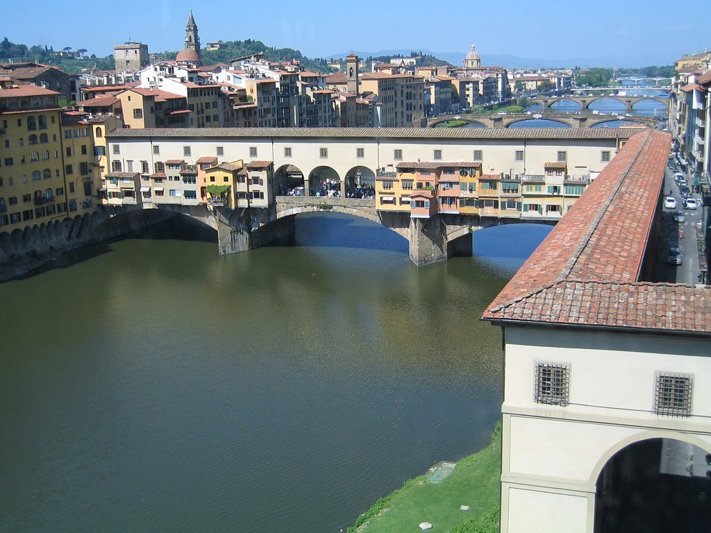

Tomorrow we visit a number of other museums here, including the Uffizi that has a large number of old Italian paintings. The courtyard of the Uffizi, which we've passed through already, has statues of a number of famous Florentines: Michelangelo, Leonardo da Vinci, Galileo Galilei, Macchiavelli, Amerigo Vespucci. There has been a lot of influence of this small town on the world.

More about Florence in our next email.

### Dispatch 6: Florence, Siena and Rome

On our second day in Florence we visited the Uffizi (pronounced "Uffid-zee") museum on the banks of the Arno river, containing a large collection of mainly Italian paintings from about the 13th century onward. Again, because our guidebook had told us to reserve tickets for the museum in advance, we were able to walk past the hour-plus-long line outside the museum and get in relatively early. This was despite the (by now expected) lack of a queue, and the resultant chaos, at the place where audioguides for the museum were being rented. Italians in general seem to be disinclined to stand in queues - in museums or outside, people tend to simply cluster around the counter and try to get the server's attention in some way. After a couple of times when people would simply cut in from the side in queues that we were standing in, we've become better at gauging how to get our order taken quickly, and whether it involves standing in a line or not.

The regular galleries in the Uffizi museum were quite good, but its real highlight was an unadvertised special exhibit tucked away in the basement on the life of Leonardo da Vinci, including original drawings and manuscripts from his work in the 16th century. We now understand what the [famous drawing](http://en.wikipedia.org/wiki/Vitruvian_Man) of the man with his arms outstretched within a square and a circle means.

Florence is a very small town apart from its museums, with not much in the way of city life. When the shopping streets and main squares are filled with people on a weekday afternoon, it's a good sign that the majority of the population consists of tourists.

While Florence is one of the most popular places to visit in Italy, the next day we visited a beautiful little town called Siena, about an hour and a half outside Florence, which seemed to be the kind of unaffected place that we had looked forward to seeing. The town is not on many tourists' itineraries, and it's possible to wander the backstreets - through narrow alleys, almost artistically weathered old buildings and cobblestone streets - and not see another person with a camera for a reasonable length of time. There aren't any major sights, but the whole town is a great experience to wander through. Unfortunately, we weren't there for long enough, because we had to catch the evening train to Rome.

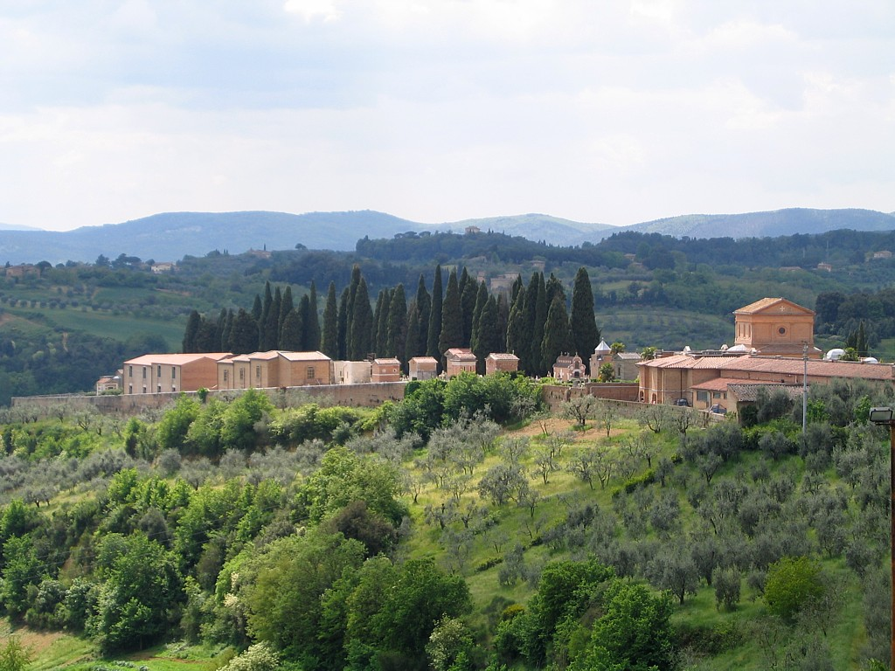
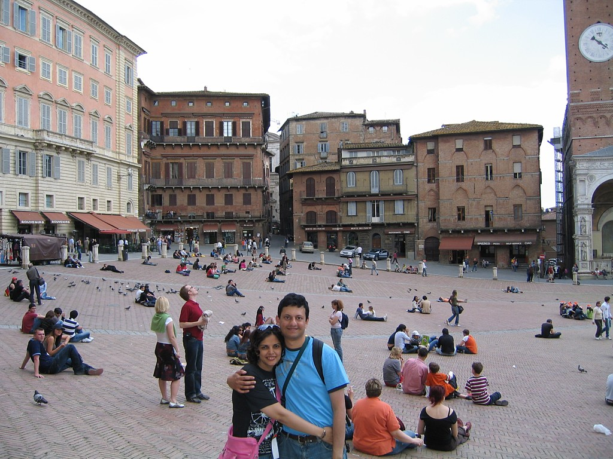

Rome is big city Italy. This is a real city with modern life taking place around monuments 2000 years old. Yesterday, our first day in Rome, we visited the Vatican City, to the west of the city center and technically its own country (although, for the record, Abhi couldn't locate a single car with a Vatican City license plate). Vatican City has two main sights, the Vatican museums (which contain the Sistine Chapel) and St Peter's Basilica (which is the place made famous by TV images of the pope, standing above St Peter's Square with thousands of people packed into the square to catch a glimpse of him). 

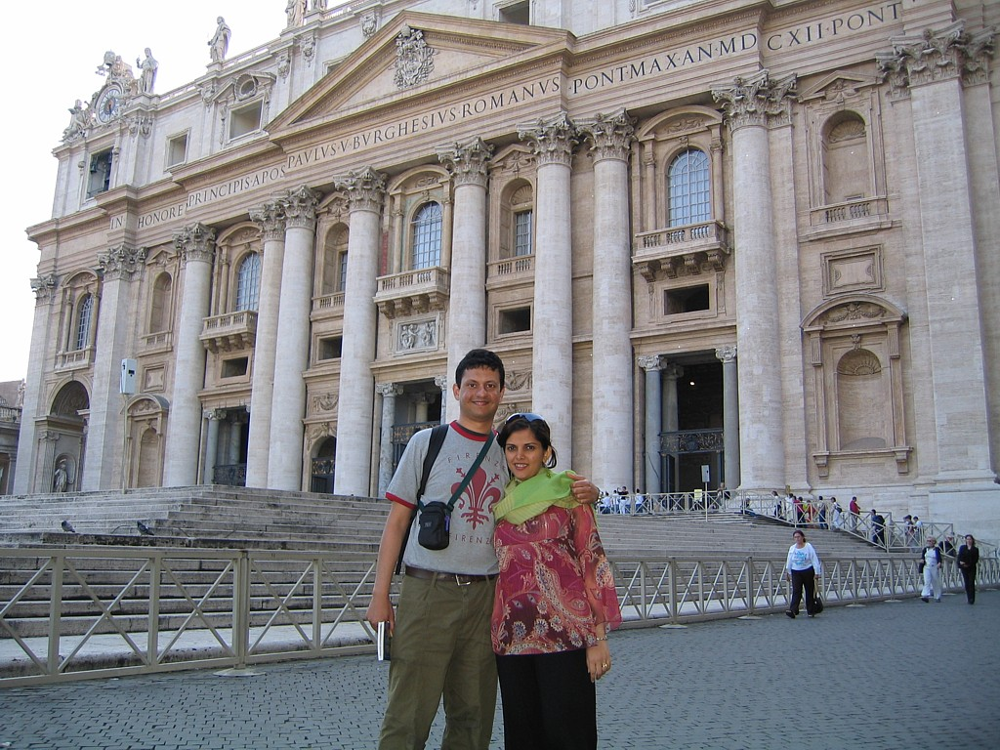

The Vatican museum (it's actually a series of connected museums) is huge - four miles of displays of Western art, starting with Roman and Greek statues and ending around the Renaissance - but poorly organized and explained. It took us about 10 minutes to walk from the entrance of the museum to the end of the line of people waiting to get in, and the inside of the museum is proportionally crowded. You are almost swept along by the tide of people passing through each room, and the explanations of each piece of art are small and unreadable except by getting very close to it. On the whole, this was a disappointment, and we didn't the notice the Pope anywhere either. The high point of the museum visit was posting a couple of postcards from the Vatican City post office inside.

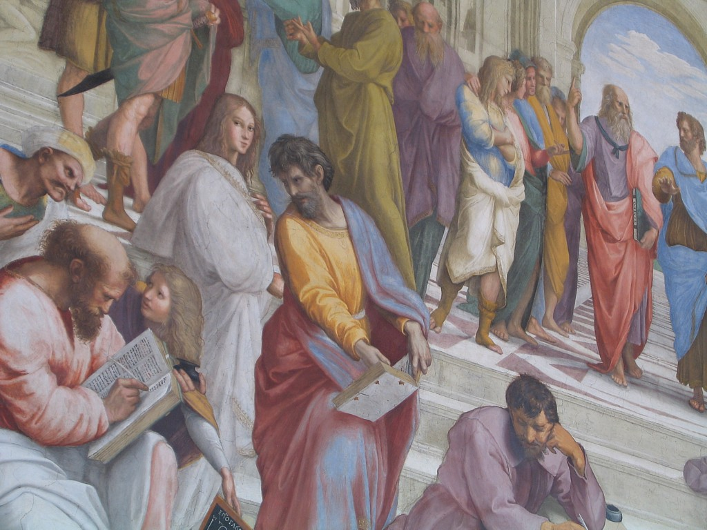
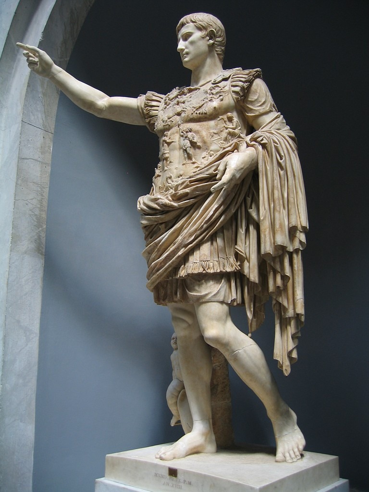

The Sistine Chapel, attached to the museum, however, lived up to its reputation. This is the ceiling that contains the famous painting of God and Adam stretching out and just barely touching with the tips of their fingers. The restoration work that went into the ceiling of the chapel, incredibly, did not add any paint to the original paintings - they simply cleaned out the dirt that had collected over the centuries. It's hard to believe that the amazingly vibrant colors on the paintings are 500 years old. The paintings on the ceiling - there is a whole sequence of them, depicting the Biblical story of the creation of Man - are painted with 3D decorative elements around their edges, and if you position yourself just right, the perspective is so exact that it's possible to believe that the edges really are embossed on the surface rather than being painted on.

St Peter's Basilica is the largest church in the world, and you're reminded of the fact - repeatedly - from the moment you walk in. Everything is big about it - it looks like a regular church, inflated to an enormous size. It's appropriately awe-inspiring, and contains some good pieces of art, but it seemed designed to impress with size rather than beauty.

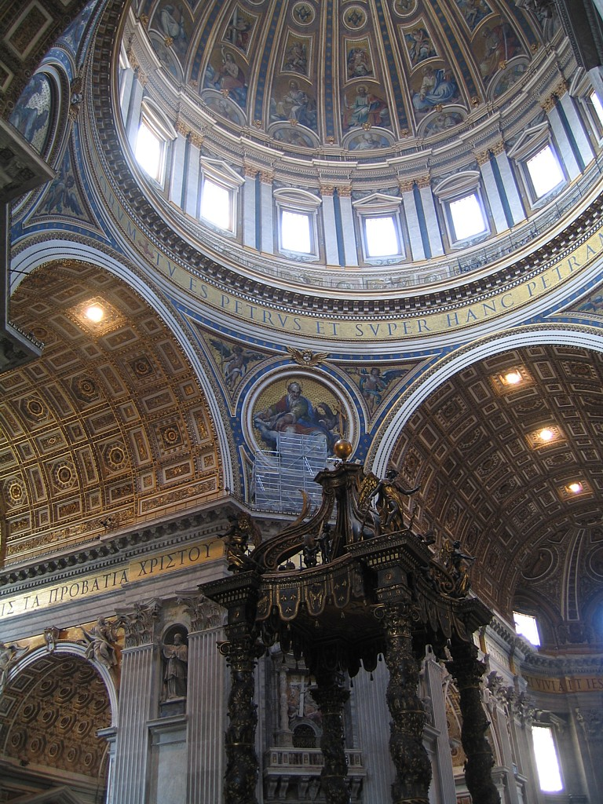

Our second day in Rome was today, which we'll write about in our next email. Just one more day of sightseeing and then we go back to California.

### Dispatch 7: Rome

This dispatch is not from Europe, but from California, where we're already feeling a kind of reverse sticker shock: prices here seem surprisingly low. After days of paying 5 euros (about $6.50) for a small glass of fruit juice all over Italy, and 2 euros for a pair of bananas on the streets of Rome, it seems strange to return to a world of free water with every restaurant meal and cheap groceries. And the restaurant server here is only too happy to get you your bill as soon as you ask for it: it seems to be a fine art form in Europe to be able to catch the eye of your waiter at any point before, during or after your meal.

Here is an account of the last two days of our trip.

Rome is superb. It's called the Eternal City, and it is possible to see why. In the 1st century AD, the Colosseum in central Rome was built to house 70,000 spectators watching gladiators fight wild animals from the far reaches of the Roman empire. Today, buses, cars and the famous Vespa scooters battle it out on the streets of Rome a few meters away from the ruins of the Colosseum, and the Rome metro disgorges passengers just across the street at the Colosseo metro stop. The Pantheon, a few blocks from the Colosseum, is a Roman temple that escaped destruction in later centuries by being converted to a Christian church. Its dome was the biggest in Europe till Michelangelo came along during the Renaissance 16 centuries later, and even today it stands incredibly unweathered in the middle of a busy square filled with restaurants, coffee shops and gelaterias. Modern life flows around monumental feats of engineering from 2000 years ago.

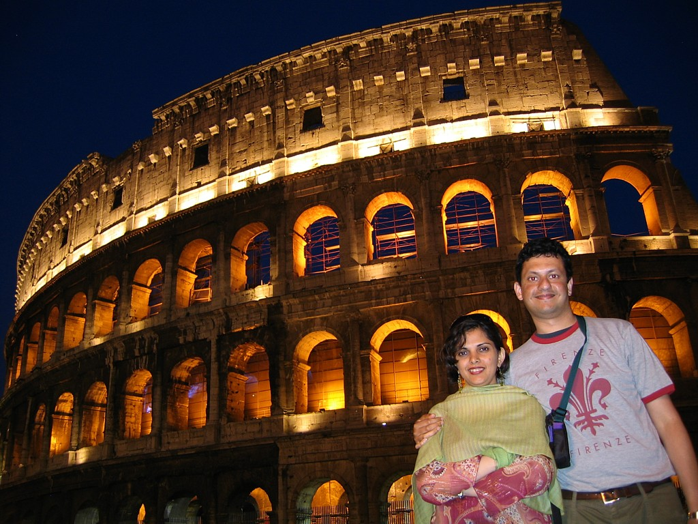
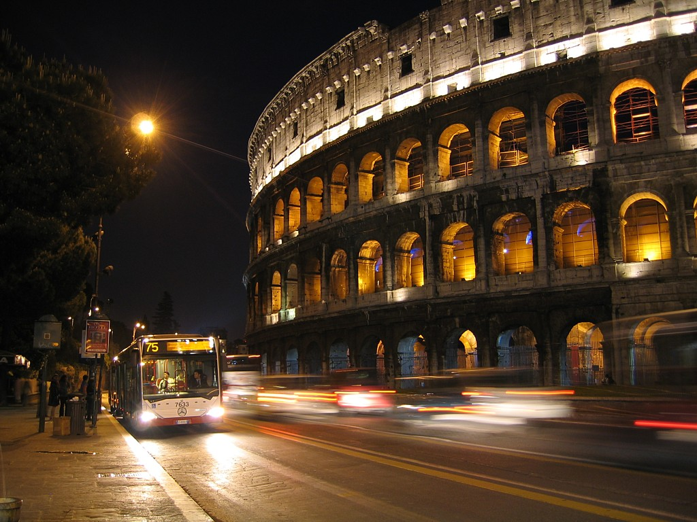

The Roman empire lasted 1000 years, from about 500 BC to 500 AD. At its peak, it extended from Portugal in the east to Turkey in the west, and from Britain in the north to Algeria in the south. A series of maps on the outside wall of the Roman Forum, the ruins of the center of government during Roman times, shows how the empire expanded over its lifetime, from a single city to probably the biggest empire ever created till then. 

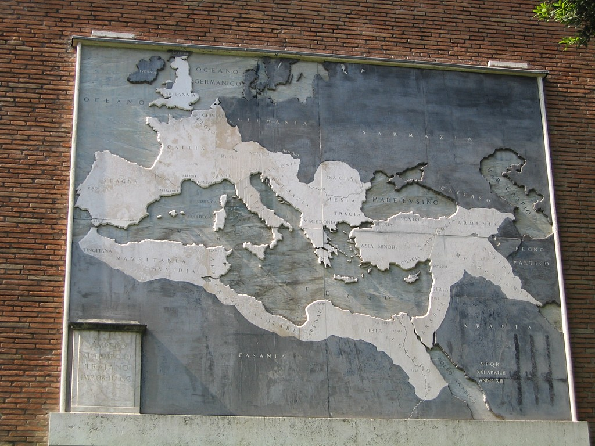

The Roman Forum today is not much more than groups of marble columns and fragments of buildings strewn over a medium-sized field, but a guided tour like the one we took helped interpret what we were seeing. The guide was an archeologist at the local university so she knew a fair bit more than the standard tour guide about what she was explaining. Over the centuries, less than enlightened citizens of Rome have "recycled" parts of these ancient structures to build other monuments either in the city or elsewhere, so the weather can only destroy what vandalism has not. Despite that, the parts that are remaining are impressive enough to give you a hint at what the entire structure might have been like. The Colosseum consists of a huge football-stadium-sized central pit with underground passages in which wild animals were kept, to be unleashed upon the gladiators from unexpected directions. 

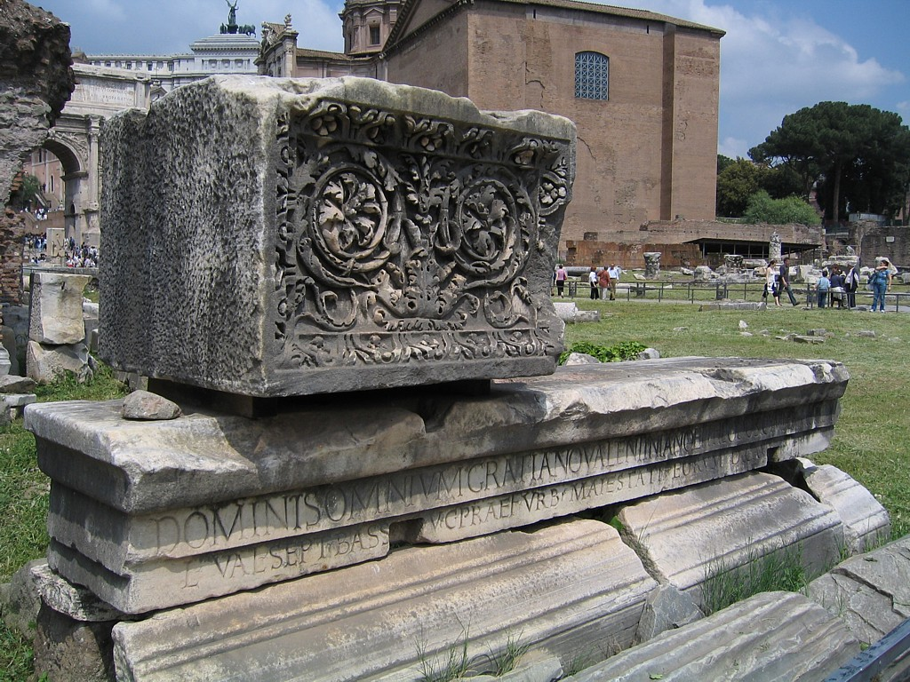

It seemed very strange to us that people who had the engineering and managerial expertise to build and efficiently fill 70,000 people stadiums could also enjoy seeing people fight animals till one of them died. Over the years, the modern city of Rome has risen about 15 feet above the level at which these old Roman monuments were built. If you walk around the Pantheon, the street is at the same level as its entrance in the front, but rises to quite a height above its foundation around the back. The Pantheon was very impressive as well, its ceiling huge and perfectly dome shaped. We've seen Gothic arches (from 13th century chapels) where perfect domes could not be created because the engineers didn't know how to support the weight of the dome - we can only assume that since the Romans did know this technology, it must have been lost during the Dark Ages that followed the fall of the Roman empire and rediscovered in Europe during the Renaissance. The Colosseum is lit beautifully at night.

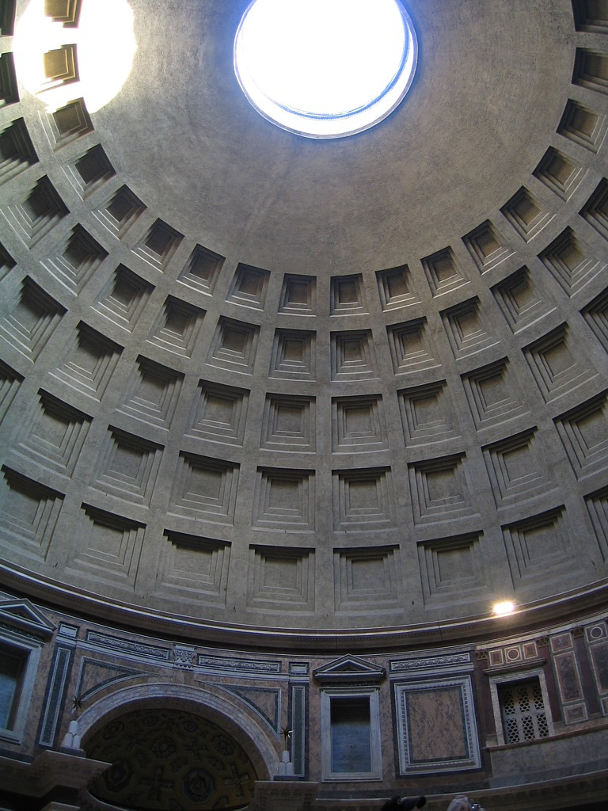

The Colosseum, the Roman Forum and the Pantheon are all located within a few minutes' walk of each other in the center of Rome. On the last day of our trip, we traveled to a palace cum art gallery on the outskirts of the city called the Borghese Gallery. The 17th century founder of the gallery was a nephew of the Pope appointed to the powerful title of Cardinal Nepote (the word from which we get the English "nepotism"). Because of his influential position, he was able to amass a large collection of art from both the Renaissance and Roman periods, and they're displayed in his lavish villa within a large Central Park-like garden. Many of the pieces in the collection are masterpieces. In the fashion of the time, broken Roman statues were completed by having contemporary sculptors add pieces to them, so there is an example of a Roman-era statue of a horse with a 17th century figure of a human rider on it. Today, the pieces would be preserved as they were found. We found the gallery quite worthwhile. On our last evening we spent our time walking through the streets of the city and trying to avoid getting run over by the very indisciplined traffic. The roundabouts in Rome are particularly dangerous places to cross the street.

(Sejal adds: We were also shocked to learn that the Burger King in Rome does not serve veggie burgers!)

The next day we boarded a flight for California. In the in-flight magazine was a list of the countries with the most number of billionaires, taken from the recent Forbes magazine survey. The US was No.1 with 345 billionaires (India was No. 9 with 19 billionaires). Italy did not figure on the list. It seemed somewhat fitting that after seeing places where so much wealth creation has happened in the past, we were returning to a place that seems pretty good at it at present.

Hope you've enjoyed reading about our trip through Europe. We had a fantastic time. Hopefully we will go back someday to visit the places we couldn't get to on this trip!

## Photo Gallery

Click on any photo to view it in full resolution.


